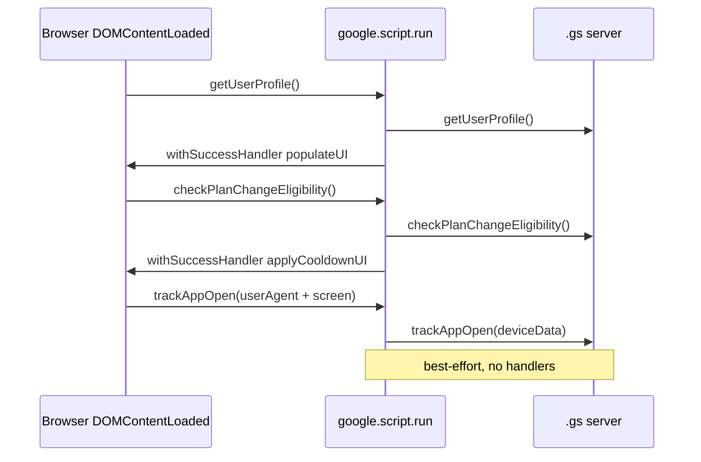

# Frontend Single-Page App

The Provident Fund UI is a single Google Apps Script `HtmlTemplate` — `html/Index.html` — that ships one static HTML shell to the browser and then does everything else client-side through `google.script.run` calls back into `.gs` server functions. There is no client router and no rebuild between actions; the "page" is a dashboard that mutates its own DOM and re-fetches profile data after each mutation.

## Shell and partials

`html/Index.html` is evaluated by `doGet()` and `include()`-pulls every other partial into one document before it reaches the browser. The order in the shell matters: CSS loads in `<head>`, the dashboard markup sits in `<main>`, and the script partials are included in a fixed sequence at the end of `<body>`.

```html
<?!= include('html/CSS'); ?>          <!-- in <head> -->
...
<?!= include('html/Modals'); ?>       <!-- enrollment wizard, beneficiary manager, <dialog> modals -->
<?!= include('html/Modals_Withdraw'); ?>  <!-- withdrawal <dialog> -->
<?!= include('html/JS_Utils'); ?>     <!-- effective-date + rel-label helpers (must load first) -->
<?!= include('html/JS_Signature'); ?> <!-- window.PFSignature -->
<?!= include('html/JS'); ?>          <!-- bootstrap + dashboard + enrollment wizard + change-plan -->
<?!= include('html/JS_Beneficiary'); ?> <!-- beneficiary manager -->
<?!= include('html/JS_Withdraw'); ?>  <!-- withdrawal modal logic -->
<?!= include('html/JS_Feedback'); ?>  <!-- post-action rating modal -->
```

Each partial is a full `<script>` (or `<dialog>`/`<div>`) block assembled into one document by `HtmlService`, so all functions and globals share one window scope. The dashboard markup lives directly in `Index.html` and has no separate template — it is a `#loadingState`, a `#dashboardContent`, and an `#errorState`, with the dashboard hidden until `populateUI` flips it visible.

## Runtime responsibilities

Each partial owns one concern:

| Partial | Responsibility |
|---|---|
| `Index.html` | Shell, dashboard markup, CDN loads (Pico.css, Bootstrap Icons, `signature_pad`), `<head>` CSS include, maintenance banner, toast node |
| `CSS.html` | Thai-themed Pico overrides (`--pico-primary` blue, 24px radius, Prompt font), `.wizard-overlay` full-screen styles, `.option-card` selection styles |
| `Modals.html` | The `#enrollWizard` and `#beneficiaryManager` wizard-overlays plus the change-investment, change-plan, cancel-tx, and feedback `<dialog>`s |
| `Modals_Withdraw.html` | The withdrawal `<dialog>` (vesting verdict, timeline, confirm checkbox) |
| `JS_Utils.html` | `getEffectiveDateInfo()` cut-off helper, `effectiveDateBannerHTML()`, `REL_LABELS` + `relLabel()` |
| `JS_Signature.html` | `window.PFSignature` — the handle-based wrapper around `signature_pad` |
| `JS.html` | Bootstrap, `populateUI`, `showSuccessToast`, enrollment wizard, change-plan, cancel-tx, withdrawal timeline builder |
| `JS_Beneficiary.html` | Beneficiary manager (views A/B/C/D), update flow |
| `JS_Withdraw.html` | Withdrawal modal logic (5-year vesting check, confirm gate) |
| `JS_Feedback.html` | Post-action star-rating modal |

## Bootstrap: `DOMContentLoaded`

On `DOMContentLoaded`, `JS.html` fires three `google.script.run` calls in parallel. There are no awaits and no error handler on the analytics call — it is best-effort.

1. `getUserProfile()` → `populateUI(response)` (or `showError` on failure) — the single source of all dashboard state.
2. `checkPlanChangeEligibility()` → `applyCooldownUI(status)` — stores a `{ locked, nextDate? }` object in the module-global `planChangeStatus`.
3. `trackAppOpen(navigator.userAgent + ' | ' + screen.width + 'x' + screen.height)` — GA4 `app_open`, fired client-side only.



The `app_open` event is fired **client-side on `DOMContentLoaded`, not server-side in `doGet()`**, because `doGet()` runs in Apps Script and cannot read the browser User-Agent. The client forwards `navigator.userAgent` plus a ` | WxH` screen-size suffix; the server (`Analytics.gs#parseDevice_`) buckets it into low-cardinality `device_category`/`device_os`/`device_browser` dimensions rather than sending the raw UA.

Because the post-action "reload" (see below) is a soft re-render that re-enters `populateUI` without a new `DOMContentLoaded`, `app_open` does **not** re-fire — so a single visit is one GA4 hit, and the forced reload does not double-count. `doGet()` deliberately does **not** call `trackAppOpen` for the same reason.

## The forced home-reload pattern

Every mutating action (enroll, change plan, update beneficiaries, withdraw, cancel) ends with `showSuccessToast(message)`. After the toast fades, `showSuccessToast` forces a full dashboard refresh:

```js
function showSuccessToast(message) {
  // ...fade the toast in...
  setTimeout(() => {
    // ...fade the toast out...
    setTimeout(() => {
      document.getElementById('successToast').style.visibility = 'hidden';
      document.getElementById('dashboardContent').style.display = 'none';
      document.getElementById('loadingState').style.display = 'block';
      google.script.run.withSuccessHandler(populateUI).getUserProfile();
      google.script.run.withSuccessHandler(applyCooldownUI).checkPlanChangeEligibility();
    }, 400);
  }, 1500);
}
```

The pattern hides `#dashboardContent`, re-shows `#loadingState`, and re-fetches `getUserProfile` + `checkPlanChangeEligibility`. This is the SPA's substitute for a server round-trip: the sheet has changed, so the client re-reads the canonical state rather than trying to patch the DOM from the action's response. The toast is the only user-visible confirmation; the modal/wizard is already closed by the time the reload fires.

### The `pendingFeedbackAction` flag

The post-action feedback modal depends on this reload. Each success handler sets a module-global `pendingFeedbackAction` (e.g. `'Enroll'`, `'Change Plan'`, `'Update Beneficiaries'`, `'Withdraw'`) **before** calling `showSuccessToast`. When the reloaded `populateUI` runs, it sees the flag, clears it, and — after a 300ms `setTimeout` — calls `openFeedback(action)`. The delay lets the freshly-rendered dashboard settle so the `<dialog>` lands on the home screen rather than the just-closed modal. If the flag were consumed inside the action's own success handler, the feedback modal would open over a stale dashboard (or before the reload hid the old content).

## `populateUI` and the eligibility state machine

`populateUI(response)` is the dashboard's single renderer. It first renders the pending-transactions box (each pending tx gets a Cancel button via `openCancelTx`), then drives a status cascade over `response.enrollment`:

- `withdrawalCount >= 3` → **Locked** (permanent), shows the withdrawal timeline.
- `isOnProbation` → **Probation**, shows the eligible-after date in `#cooldownMessage`.
- `isCoolingDown` → **Cooldown**, shows the withdrawal timeline + re-enroll date.
- `isEnrolled` with no pending Enroll → **Enrolled #N**, shows the `#enrolledActionsGroup` 2x2 action grid.
- otherwise → **Eligible #N**, shows `#mainEnrollBtn`.

### The `#cooldownMessage` placement invariant

`#cooldownMessage` **must** live directly inside the Actions `<article>`, **not** inside `#enrolledActionsGroup`. `#enrolledActionsGroup` is `display:none` for non-enrolled users (probation / cooldown / locked), and `showWithdrawalMessage` sets `#cooldownMessage` to `display:block`. If the message were nested inside the hidden group, setting it visible would still be invisible to the user because its parent stays hidden. Keeping it as a sibling of the group is what makes the "eligible to re-enroll on …" / withdrawal-timeline message render for cooldown and locked users.

## Multi-step flows: wizard-overlay, not native `<dialog>`

The enrollment wizard (`#enrollWizard`) and the beneficiary manager (`#beneficiaryManager`) are multi-step flows that need to take over the whole viewport. They use a custom `.wizard-overlay` (`position: fixed; inset: 0; z-index: 9999`), **not** the native `<dialog>` element. The overlay gives full control over the fixed header / scrollable content / sticky footer layout and locks the body scroll (`document.body.style.overflow = 'hidden'`) while open.

Simple, single-purpose confirmations use the native `<dialog>` element with `.showModal()` / `.close()`:

| Modal | Element | Open / close |
|---|---|---|
| Change contribution plan | `<dialog id="changePlanModal">` | `openChangePlan` / `closeChangePlan` |
| Change investment plan (bank-app redirect) | `<dialog id="changeInvestModal">` | `openChangeInvest` / `closeChangeInvest` |
| Cancel pending transaction | `<dialog id="cancelTxModal">` | `openCancelTx` / `closeCancelTx` |
| Withdrawal | `<dialog id="withdrawModal">` | `openWithdraw` / `closeWithdraw` |
| Post-action feedback | `<dialog id="feedbackModal">` | `openFeedback` / `closeFeedback` |

### Enrollment wizard (5 steps)

`openEnroll()` resets `wizData`, destroys any prior signature pad, shows the overlay, and calls `updateWizardUI()`. Steps 1–5: contribution → investment → beneficiaries → summary → sign & submit. `updateWizardUI` shows only `#wizStep{currentStep}`, flips the Next button to a Submit button on step 5, and mounts a fresh `PFSignature` pad on entering step 5. `validateStep()` is called on every input and every stroke, so the Next/Submit button enables as soon as the current step is valid (beneficiary total must equal exactly 100%, signature must be non-empty). `wizardNext()` either advances or, on step 5, calls `submitEnrollWizard()`.

### Beneficiary manager (views A/B/C/D)

`openManageBen()` switches to view A (current), which renders the saved `beneficiariesJSON`. The manager reuses the same prefix/relationship option fragments and the same `splitPrefix`/`mergePrefixes` round-trip as the wizard. The signature pad is mounted fresh each time view D opens. The `preserve` flag on `switchBenView` re-renders the edit list without resetting `editBenData`, so in-progress edits survive a B → D → B round-trip.

## `PFSignature` — the signature-pad wrapper

`html/JS_Signature.html` exposes `window.PFSignature`, a small handle-based wrapper over the CDN-loaded `signature_pad` library. Each flow (enrollment step 5, beneficiary sign view) owns its own pad instance via a handle so they don't collide.

```js
const handle = PFSignature.mount(canvas, onEnd?);  // returns { pad, canvas, onEnd, resize }
PFSignature.isEmpty(handle);   // -> bool
PFSignature.getDataUrl(handle); // -> "data:image/png;base64,..." or null
PFSignature.clear(handle);
PFSignature.destroy(handle);   // call on overlay close to drop resize listener
```

The pad uses dark-blue ink (`#1e3a8a`), a transparent background (so only the ink lands in the PDF), and is Hi-DPI aware — `sizeCanvas` scales the backing store by `devicePixelRatio` so strokes are crisp on mobile (the primary platform). Because `signature_pad` clears the canvas on a backing-store resize, the pad is mounted fresh on each open and the window `resize` listener is removed in `destroy` to avoid leaks.

### Auto-trim to the ink's bounding box

`getDataUrl` first tries `trimToInk(canvas)`, which scans the alpha channel in device pixels, computes the ink's bounding box, adds an 8px pad (in device pixels) so 2px strokes aren't clipped, and exports just that crop as a PNG data URL. If there is no ink or the scan throws, it falls back to the full-canvas `pad.toDataURL`. The effect is that a small or corner signature exports tight (no huge empty margin); the letter generator then scales that tight crop to fit its signature box. Callers must therefore treat a `null` return as "no signature" and gate the submit button on `PFSignature.isEmpty(handle)`.

## Beneficiary data model and prefix round-trip

The stored beneficiary JSON shape is `{ name, rel, pct, address }` — **no** `prefix` field. The UI, however, shows a separate title (`Mr.`/`นาย`/…) dropdown because the bank requires every beneficiary name to carry a title. `prefix` is a **transient UI-only field**:

- `mergePrefixes(list)` runs right before submission: `{ prefix, name, ... }` → `{ name: "prefix name", ... }`.
- `splitPrefix(b)` runs on re-edit (beneficiary manager view B init): it pulls a known leading title (`PREFIX_LIST`) back out of `name` into `prefix` so the dropdown is populated and a re-save does **not** double-prefix.

The same `prefixOptions`/`relOptions` fragments and the same 100%-total validation are shared by the wizard and the manager.

## Relationship with the server

The SPA is a thin client over a set of `.gs` server functions reached through `google.script.run`:

| Client call | Server function | Returns |
|---|---|---|
| `getUserProfile()` | `Code/Profile.gs#getUserProfile` | full dashboard state (enrollment, pending tx, tenure, probation, cooldown) |
| `checkPlanChangeEligibility()` | `Code/Action.gs#checkPlanChangeEligibility` | `{ locked, nextDate? }` |
| `trackAppOpen(deviceData)` | `Code/Analytics.gs#trackAppOpen` | (best-effort, ignored) |
| `processEnrollment(payload, deviceData)` | `Code/Action.gs` | `{ success, msg }` |
| `processChangePlan(plan, deviceData)` | `Code/Action.gs` | `{ success, msg }` |
| `processUpdateBeneficiaries(payload, deviceData)` | `Code/Action.gs` | `{ success, msg }` |
| `processWithdrawal(deviceData)` | `Code/Action.gs` | `{ success, msg }` |
| `cancelTransaction(txId, deviceInfo)` | `Code/Action.gs` | `{ success, msg }` |
| `submitFeedback(payload)` | `Code/Feedback.gs` | (best-effort) |

<!-- openwiki: broken internal link [../google-apps-script-platform.md] file "../google-apps-script-platform.md" does not exist. Fix the href or restore the target, then delete this comment. -->
<!-- openwiki: broken internal link [../system-overview.md] file "../system-overview.md" does not exist. Fix the href or restore the target, then delete this comment. -->
All actions pass `navigator.userAgent` (and sometimes a ` | WxH` suffix) as `deviceData`, both for the audit log and so `trackFeatureAction` can attach the same device dimensions as `app_open`. See [google-apps-script-platform.md](../google-apps-script-platform.md) for the server side and [system-overview.md](../system-overview.md) for the end-to-end data model.

## Invariants and failure modes

- **No double `app_open`.** Firing `app_open` in `doGet()` would double-count because the post-action reload re-enters `populateUI` without a new `DOMContentLoaded`; firing it only on `DOMContentLoaded` keeps one hit per real load.
- **`#cooldownMessage` is a sibling of `#enrolledActionsGroup`.** Nesting it would hide the eligible-after / withdrawal-timeline message for the very users it targets (cooldown/locked, who never show `#enrolledActionsGroup`).
- **Signature pad is mounted fresh per open.** Resizing the canvas wipes the drawing (a `signature_pad` requirement), so `mountWizSignature` / `mountBenSignature` destroy the prior handle and mount a new one on entering the sign step; `closeWizard` / `closeManageBen` destroy on exit.
- **`getDataUrl` trims to the ink bounding box.** A small/corner signature exports tight; the letter scales the crop. Callers gate on `PFSignature.isEmpty`, not on a non-null data URL.
- **Actions are best-effort on analytics, never blocking.** `trackAppOpen` / `trackFeatureAction` swallow all errors and no-op when `GA4_MEASUREMENT_ID` / `GA4_API_SECRET` are unset.
- **`pendingFeedbackAction` is set before `showSuccessToast`.** The flag is consumed by the reloaded `populateUI`, so the feedback modal lands on the home screen after the reload, not over the just-closed modal.
- **Beneficiary total must equal exactly 100%.** `validateStep` (wizard) and `validateUpdateBen` (manager) disable Next/Save until the sum is exactly 100 and every field is filled.
- **`doGet` uses `createTemplateFromFile` + `evaluate`.** Using `createHtmlOutputFromFile` would break the `<?!= ?>` includes; `include()` itself returns `HtmlService.createHtmlOutputFromFile(filename).getContent()`.
