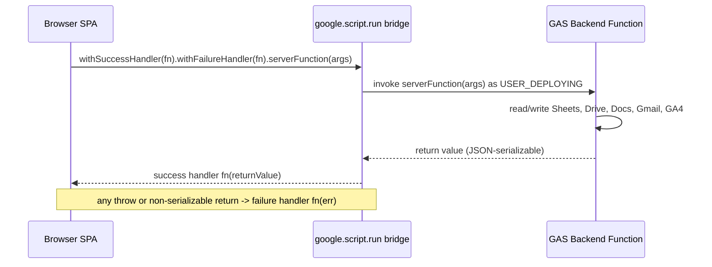

# System Overview

The Provident Fund app is a mobile-first, bilingual (Thai/English) self-service web app that lets employees enroll in and manage a company Provident Fund — check status, enroll, adjust contributions, manage beneficiaries, and process withdrawals — with the confirmation paperwork (emails and signed PDF letters) the process requires. It runs with **zero external infrastructure**: Google Workspace handles identity, data, documents, email, and analytics.

This page is the hub for the architecture. Every other architecture and workflow page links back here. The core model is three runtime domains connected by a single, asymmetric bridge:

<!-- openwiki: mermaid parse failed and this diagram was converted to a text fence so it does not break rendering. Fix the diagram source and restore the mermaid fence. Parser error: Heuristic: an unescaped angle bracket inside a label breaks rendering; rephrase the label. -->
```text
flowchart LR
  Browser["Browser SPA<br/>html/*.html + Pico.css"] -->|google.script.run| GAS["GAS Backend<br/>Code/*.gs"]
  GAS -->|HtmlService.evaluate + include| Browser
  GAS --> Sheets["Google Sheets<br/>Users, Enrollments, ..."]
  GAS --> Drive["Google Drive<br/>PDF letter archive"]
  GAS --> Docs["Google Docs<br/>letter templates"]
  GAS --> Gmail["Gmail<br/>confirmation emails"]
  GAS --> GA4["GA4 Measurement Protocol<br/>adoption metrics"]
```

*Figure: the three runtime domains — browser SPA, GAS backend, and Google Workspace services — and the single google.script.run bridge that connects the browser to the backend. The backend is the only party that touches Sheets, Drive, Docs, Gmail, and GA4.*

## Runtime domains

### Browser SPA (frontend)

The frontend is a **vanilla JavaScript single-page app** styled with [Pico.css](https://picocss.com/) v2 (loaded from CDN, not bundled). There is no build step and no framework. State lives in a handful of module-level variables (`globalEnrollmentData`, `globalUserProfile`, `planChangeStatus`, `pendingFeedbackAction`) and the UI is re-rendered imperatively after each action by re-fetching the profile.

The shell is `html/Index.html`, which composes the page from HTML partials using Apps Script templating scriptlets:

```html
<?!= include('html/CSS'); ?>
...
<?!= include('html/Modals'); ?>
<?!= include('html/Modals_Withdraw'); ?>
<?!= include('html/JS_Utils'); ?>
<?!= include('html/JS_Signature'); ?>
<?!= include('html/JS'); ?>
<?!= include('html/JS_Beneficiary'); ?>
<?!= include('html/JS_Withdraw'); ?>
<?!= include('html/JS_Feedback'); ?>
```

`include()` is a server-side helper in `Main.gs` that returns `HtmlService.createHtmlOutputFromFile(filename).getContent()`. Because these are templating scriptlets (`<?!= ?>`), the entry point **must** render the template via `HtmlService.createTemplateFromFile('html/Index').evaluate()` — `createHtmlOutputFromFile` would silently fail to expand the includes.

The partials are split by concern:

- `CSS.html` — custom styles layered over Pico.css v2.
- `JS.html` — dashboard logic, the 5-step enrollment wizard (step 5 = signature), and the change-plan modal.
- `JS_Beneficiary.html` — beneficiary manager (current / edit / history / sign views).
- `JS_Withdraw.html` — withdrawal flow with 5-year vesting check.
- `JS_Feedback.html` — post-action star-rating modal.
- `JS_Utils.html` — shared helpers (effective-date banner, `REL_LABELS`/`relLabel()`).
- `JS_Signature.html` — the shared `window.PFSignature` wrapper over the `signature_pad` CDN library (hi-DPI, dark-blue ink, auto-trimmed export).
- `Modals.html` / `Modals_Withdraw.html` — dialog/wizard markup.

Multi-step flows (enrollment wizard, beneficiary manager) use a custom `position:fixed` overlay (class `wizard-overlay`) rather than native `<dialog>`; simpler modals (change-plan, withdraw, feedback) use native `<dialog>`.

### GAS backend

The backend is a **Google Apps Script web app** bound to a Google Spreadsheet. It is split by responsibility across `.gs` files in `Code/`. Each file owns a coherent concern, but all run in the same single server-side execution context (one global namespace), so cross-file calls are plain function calls.

| File | Responsibility |
|------|----------------|
| `Main.gs` | `doGet()` entry point; `include()` HTML templating helper; maintenance-mode gate. |
| `Config.gs` | Global constants: `SPREADSHEET_ID`, sheet-name constants, `ADMIN_EMAILS`, `REL_LABELS` (Thai-first relationship display map). |
| `Profile.gs` | `getUserProfile()` — primary data fetch; computes eligibility, tenure, match tier; `getPendingTransactions()` (cancellable in-progress actions); `checkPlanChangeEligibility()`. |
| `Action.gs` | Write handlers + cancel: `processEnrollment`, `processChangePlan`, `processUpdateBeneficiaries`, `checkPlanChangeEligibility`, `cancelTransaction`. |
| `Withdraw.gs` | `processWithdrawal` (vesting + cooldown rules). |
| `Email.gs` | `sendActionConfirmation({...})` — bilingual Thai-first confirmation emails; never throws; HTML-escaped. |
| `Letter.gs` | `generateLetter(type, ctx, sigDataUrl)` — Google Doc template → PDF with embedded signature, archived in Drive. May throw; caller wraps in try/catch. |
| `Analytics.gs` | GA4 Measurement Protocol: `trackEvent`, `trackAppOpen`, `trackFeatureAction`; pseudonymous `user_id`; low-cardinality device dimensions. Best-effort, never throws. |
| `Utils.gs` | `calculateMatchTier(years)`, `relLabel(key)`, `generateTransactionId(prefix)`, `appendRowToSheet`, `getEffectiveDate`, `patchAuditEventData`, `reportIssueToAdmin`. |
| `Feedback.gs` | `submitFeedback({action, rating, comment})` — appends star ratings to the `App_Feedback` sheet. Best-effort. |
| `TestCases.gs` | Editor-run test harnesses (not part of the runtime). |

### Google Workspace services

Only the backend ever touches these; the browser has no direct access to any of them.

- **Google Sheets** — the system of record. `SPREADSHEET_ID` is resolved from the bound spreadsheet via `SpreadsheetApp.getActiveSpreadsheet().getId()`. Sheet column access is positional, resolved by `headers.indexOf('ColumnName')`, so **column order in each sheet matters**. The sheets are `Users` (employee master), `Enrollments` (one row/employee fund state), `Beneficiaries` (append-only ledger of JSON `Beneficiary_Data`), `Audit_Log` (append-only audit trail), `App_Feedback` (ratings), and `Monthly_Reporting` (declared but not yet used).
- **Google Drive** — archive for the signed PDF letters (folder from `PF_LETTERS_FOLDER_ID` Script Property).
- **Google Docs** — letter templates with placeholders that `Letter.gs` fills and converts to PDF.
- **Gmail** — confirmation emails sent by `Email.gs` via `sendActionConfirmation(...)`.
- **GA4 (Measurement Protocol)** — adoption metrics POSTed from `Analytics.gs` via `UrlFetchApp`. Because the hits originate from Google's IP/UA rather than the user's, GA4's native device detection is useless; explicit `device_category`/`device_os`/`device_browser` custom dimensions are the only device signal.

## The google.script.run bridge

All client↔server communication goes through **one mechanism**: `google.script.run.withSuccessHandler(fn).withFailureHandler(fn).serverFunction(args)`. There is no `fetch`, no REST endpoint, no external API layer. The backend is never addressed by URL; it is addressed by server-side **function name**.



*Figure: control flow of a single `google.script.run` call. The browser names a server function; the bridge invokes it asynchronously and routes either a serialized return value to the success handler or any thrown error to the failure handler.*

This bridge is **asynchronous and asymmetric**:

- The success handler receives the function's **return value**, which must be JSON-serializable. Handlers return plain objects like `{ success: true, msg: "..." }`.
- The **failure handler** receives any thrown exception. A handler's `try/catch` typically returns `{ success: false, msg: ... }` rather than throwing, so business-rule failures arrive at the success handler while only unexpected runtime errors reach the failure handler.
- The call runs as the **deploying user** (`"executeAs": "USER_DEPLOYING"`), with domain-wide access (`"access": "DOMAIN"`), so the end user's identity comes from `Session.getActiveUser().getEmail()` inside the handler — not from any credential passed by the client. The client never sends identity; it is inferred server-side.

The page-load sequence issues three independent calls on `DOMContentLoaded`: `getUserProfile` (success handler `populateUI`), `checkPlanChangeEligibility` (success handler `applyCooldownUI`), and a best-effort `trackAppOpen` (no handlers). After a successful main action, `showSuccessToast` forces a soft home-reload by re-issuing `getUserProfile` + `checkPlanChangeEligibility` to refresh state. GA4 `app_open` is fired **client-side** here (not in `doGet()`) specifically so it can carry `navigator.userAgent` — `doGet()` cannot see the browser's User-Agent.

## Identity, configuration, and operations

- **User identity** is always `Session.getActiveUser().getEmail()` server-side, lowercased and trimmed. It is the join key across the `Users`, `Enrollments`, `Beneficiaries`, and `Audit_Log` sheets (via `Allstars_ID`).
- **Bound script** — the project is a container-bound script on the spreadsheet, so `SpreadsheetApp.getActiveSpreadsheet()` resolves the data store; the `SPREADSHEET_ID` constant is derived from it.
- **Script Properties** hold operational secrets and per-environment IDs, never source: `MAINTENANCE_MODE`, `GA4_MEASUREMENT_ID`, `GA4_API_SECRET`, `GA4_USER_ID_SALT`, `PF_ENROLLMENT_TEMPLATE_ID`, `PF_BENEFICIARY_TEMPLATE_ID`, `PF_LETTERS_FOLDER_ID`, `PF_SIG_MAX_WIDTH`/`PF_SIG_MAX_HEIGHT`. These are set under Project Settings → Script Properties.
- **Maintenance mode** — when `MAINTENANCE_MODE === 'true'`, `doGet()` returns the `html/Maintenance` template to non-admins; emails listed in `ADMIN_EMAILS` (in `Config.gs`) bypass the gate and see the live app with a warning banner.
- **Deployment** — changes are pushed to the GAS draft with `clasp.cmd push` (Windows PowerShell) from the repo root. The `appsscript.json` manifest sets V8 runtime, `Asia/Bangkok` timezone, `USER_DEPLOYING` execution, `DOMAIN` access, and Stackdriver exception logging.

## Action handler contract

The write handlers in `Action.gs` and `Withdraw.gs` follow a consistent shape, which is the spine of the app's data flow. A representative handler, `processEnrollment`:

1. Resolve identity (`Session.getActiveUser().getEmail()`) and look up the user in `Users` to get `Allstars_ID` and profile fields.
2. Generate a transaction id (`generateTransactionId("EN")`) up front so it threads through audit, letter, email, and later patching.
3. Write the business state to the `Enrollments` sheet (upsert) and append to the `Beneficiaries` ledger.
4. Append an `Audit_Log` row carrying prior and new values plus `deviceData`.
5. **Best-effort side effects**: generate the signed PDF letter (`generateLetter`, wrapped in try/catch — may throw) and send the confirmation email (`sendActionConfirmation`, never throws).
6. Patch the audit row with `patchAuditEventData(txId, ...)` to stamp `emailSent`/`emailError`.

The critical invariant: **email and letter failure must never block or roll back the action**. The handler still returns `{ success: true }` once the sheet writes succeed. This is why email/letter code is best-effort and why the audit patch happens last.

## How the parts connect

- For the frontend SPA composition and the per-partial responsibilities, see [Frontend SPA](/openwiki/architecture/frontend-spa.md).
- For the GAS platform constraints (templating, identity, deployment, Script Properties), see [Google Apps Script Platform](/openwiki/architecture/google-apps-script-platform.md).
- For the sheets, fields, and stored data shapes (including the JSON beneficiary model), see [Data Model](/openwiki/concepts/data-model.md).
- For the end-to-end write-handler sequence (audit → letter → email → patch) and cancellation, see [Confirmation Pipeline](/openwiki/workflows/confirmation-pipeline.md).
