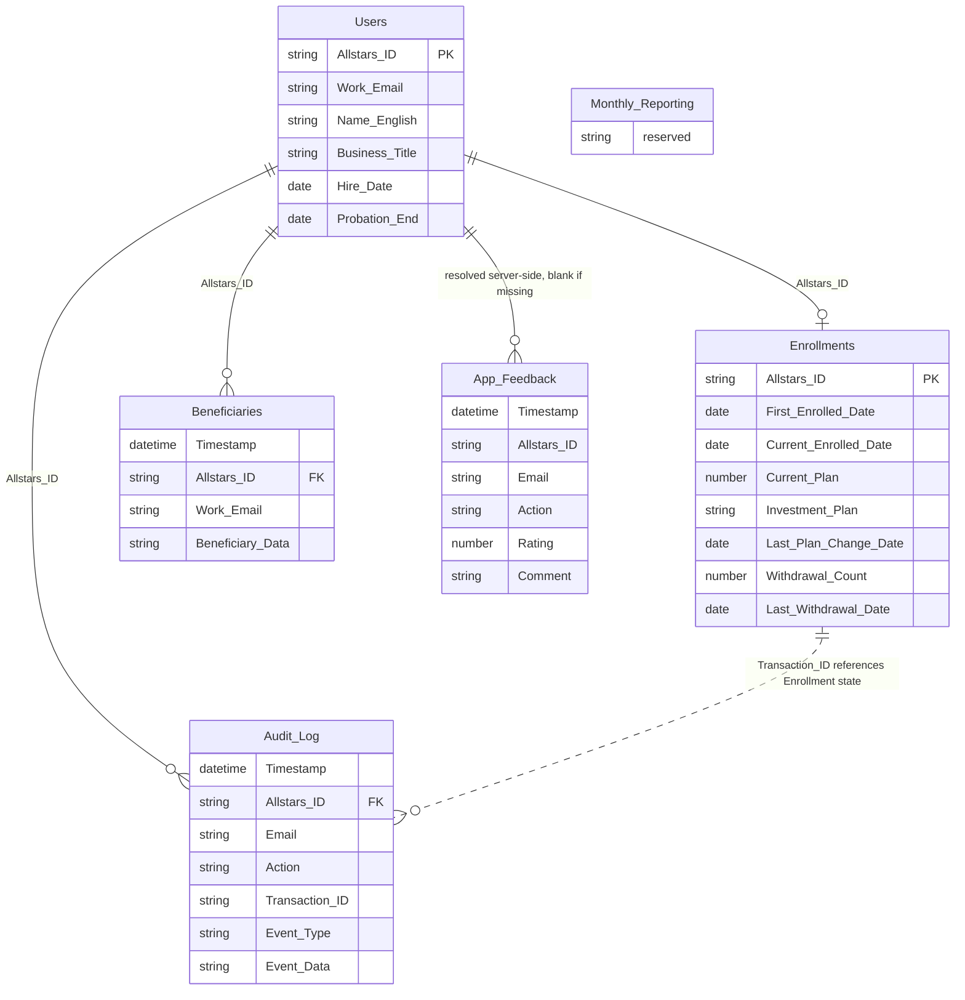

# Data Model & Google Sheets Schema

The Provident Fund app persists its state in **six Google Sheets** inside the bound spreadsheet (`SpreadsheetApp.getActiveSpreadsheet()`). The backend reads and writes them directly from the `.gs` server-side code — there is no ORM, no SQL, no database. Every column lookup is a string match against the header row, and three of the sheets (`Beneficiaries`, `Audit_Log`, `App_Feedback`) are append-only ledgers. This page documents the schema of each sheet, the single join key that ties the core four together, and the data-type disciplines that are not enforced by Sheets but are required for the code to behave.

## The six sheets and their roles

| Sheet (`Config.gs` constant) | Sheet name | Role |
|---|---|---|
| `SHEET_USERS` | `Users` | Employee master record — one row per active staff. Identity + hire/probation. |
| `SHEET_ENROLLMENTS` | `Enrollments` | One row per employee who has ever enrolled. Current cycle state (plan, count, dates). |
| `SHEET_BENEFICIARIES` | `Beneficiaries` | Append-only ledger of beneficiary lists, newest row = active. |
| `SHEET_AUDIT` | `Audit_Log` | Append-only audit trail of every user action + cancellation. |
| `SHEET_FEEDBACK` | `App_Feedback` | Post-action 1–5 star ratings + comments. Must exist with headers in row 1. |
| `SHEET_REPORTING` | `Monthly_Reporting` | Declared in `Config.gs` but not yet wired to any code. |

The sheet-name string constants live in `Config.gs`; the code references them as `SHEET_USERS`, `SHEET_ENROLLMENTS`, `SHEET_BENEFICIARIES`, `SHEET_AUDIT`, `SHEET_FEEDBACK`, and `SHEET_REPORTING`. `Monthly_Reporting` is the one sheet that is declared but never read or written by the current code — it is a reserved placeholder.

## The Allstars_ID join key

`Allstars_ID` is the **only** field that links the core four sheets together. It must be named exactly `Allstars_ID` and hold the same value across `Users`, `Enrollments`, `Beneficiaries`, and `Audit_Log`. A user is resolved by `Work_Email` from the `Users` sheet, and from there `Allstars_ID` is the key threaded into every downstream lookup — the enrollment row, the beneficiary ledger rows, the audit rows, and (best-effort, blank if not found) the feedback row.



*Allstars_ID is the join key across Users, Enrollments, Beneficiaries, and Audit_Log. App_Feedback joins best-effort (Allstars_ID resolved server-side, blank if the user is not in Users). Monthly_Reporting is declared but unused.*

### Join mechanics in code

`getUserProfile()` (`Profile.gs`) is the canonical read path and shows the join in action:

1. **Resolve identity by email.** `Session.getActiveUser().getEmail()` is matched case-insensitively against `Users.Work_Email`; the matching row yields `Allstars_ID`, `Hire_Date`, `Probation_End`, etc.
2. **Enrollments join on `Allstars_ID`.** `enrollData[j][enIdCol]` is string-compared (trimmed) to `String(allstarsId).trim()` to load the current cycle state.
3. **Beneficiaries join on `Allstars_ID`, read bottom-up.** The ledger is scanned from the last row upward; the first matching row is the active beneficiary set, and every match is pushed into `beneficiaryHistory`.
4. **Audit_Log join on `Allstars_ID`** (via `getPendingTransactions`) to find the latest event per `Transaction_ID` for the in-progress box.

`App_Feedback` is the one sheet that joins **best-effort**: `submitFeedback()` resolves `Allstars_ID` from `Users` inside a try/catch and leaves it blank if the user is not found — a failed lookup never surfaces as an error because feedback is recorded after the action already succeeded.

## Per-sheet schemas

The exact header names the code expects. A column the code looks up by `headers.indexOf('ColumnName')` — any other spelling returns `-1` and silently breaks that field.

### Users (`SHEET_USERS`)

One row per active staff. The spine of the dataset; every other sheet's `Allstars_ID` must trace back to a row here.

| Column | Type | Purpose |
|---|---|---|
| `Allstars_ID` | string | Primary key / join key. |
| `Work_Email` | string | Login identity (`Session.getActiveUser().getEmail()`), matched case-insensitively + trimmed. |
| `Name_English` | string | Display name; used in emails + signed letters. |
| `Business_Title` | string | Job title; used in the enrollment letter context. |
| `Hire_Date` | **date** | Tenure baseline for first enrollment (`memberSinceDate`). |
| `Probation_End` | **date** | Future date → probation block on enrollment. |

### Enrollments (`SHEET_ENROLLMENTS`)

One row per employee who has ever enrolled. Holds the *current* cycle state, not history — the row is updated in place on enroll/re-enroll/change-plan/withdraw. `Beneficiaries` and `Audit_Log` hold the history.

| Column | Type | Purpose |
|---|---|---|
| `Allstars_ID` | string | Join key to `Users`. |
| `First_Enrolled_Date` | **date** | Set once on first enrollment, never overwritten. Its *emptiness* drives the `wasFirstEnrollment` flag in `processEnrollment`. Not read for math, but a blank value on an enrolled member causes a wrong-date bug on their next re-enrollment. |
| `Current_Enrolled_Date` | **date** | Current cycle start. **Drives tenure / match tier / 5-year vesting when `Withdrawal_Count >= 1`** (re-enrollment restarts tenure here). |
| `Current_Plan` | number (decimal) | The **enrolled flag**: a set decimal (e.g. `0.05` = 5%) means enrolled; **blank = not enrolled**. The UI multiplies by 100 for display. |
| `Investment_Plan` | string | Pairs with `Current_Plan`; set when enrolled, blank when not. **The column must exist** or `processEnrollment` returns an admin error. |
| `Last_Plan_Change_Date` | **date** | Anchor for the 6-month plan-change lock, measured from `max(Current_Enrolled_Date, Last_Plan_Change_Date)`. Optional / blank = no recent change. |
| `Withdrawal_Count` | **number** | Numeric `0`/`1`/`2`/`3` — not a string. `3` = permanent lockout. |
| `Last_Withdrawal_Date` | **date** | Set on withdrawal; blank until then. For count 1 or 2 the cooldown math runs against `this date + 6 months`. |

### Beneficiaries (`SHEET_BENEFICIARIES`) — append-only ledger

| Column | Type | Purpose |
|---|---|---|
| `Timestamp` | **date** | Time of the update; also the implicit ordering key for the ledger. |
| `Allstars_ID` | string | Join key to `Users`. |
| `Work_Email` | string | Acting user's email (denormalized for auditability). |
| `Beneficiary_Data` | string (JSON) | A JSON-stringified array of `{name, rel, pct, address}` objects. |

**Discipline:** every update **appends** a row; no row is ever edited or deleted. The current active beneficiary set is the **newest** matching row (read bottom-up), and full history is preserved in the older rows. `processEnrollment` and `processUpdateBeneficiaries` both append `[today, allstarsId, email, beneficiariesJSON]` — the beneficiary list itself is never stored in the `Enrollments` sheet.

### Audit_Log (`SHEET_AUDIT`) — append-only audit trail

| Column | Type | Purpose |
|---|---|---|
| `Timestamp` | **date** | Time of the event. |
| `Allstars_ID` | string | Join key to `Users`. |
| `Email` | string | Acting user's email. |
| `Action` | string | `Enroll` / `Change Plan` / `Withdraw` / `Update Beneficiaries` / ... |
| `Selected_Plan` | string | Formatted plan % (display), e.g. `5%`. |
| `Investment_Plan` | string | Investment plan (when relevant). |
| `Beneficiary_Data` | string (JSON) | Raw beneficiaries JSON (when relevant). |
| `Metadata` | string | Device data or `"Unknown Device"` / `"Cancelled via dashboard"`. |
| `Transaction_ID` | string | Groups the events of one action (`EN-…` / `PC-…` / `WD-…` / `BN-…`). |
| `Event_Type` | string | `SUBMITTED` / `CANCELLED` / `EDITED`. |
| `Event_Data` | string (JSON) | JSON string with `priorValues` / `newValues` + post-commit stamps (`emailSent`, `letterFileId`, ...). |

**Discipline:** append-only. A `SUBMITTED` row is written by the action handler, then `patchAuditEventData(txId, eventType, extraFields)` **re-finds that row by `Transaction_ID + Event_Type` and merges extra fields into the existing `Event_Data` JSON** — it does not append a new row. This is how post-commit outcomes (email sent? letter generated?) are stamped onto the audit row after the action already succeeded. `cancelTransaction` appends a separate `CANCELLED` row carrying the **same `Transaction_ID`** for continuity, and a `Withdraw` cancellation rolls back the count and `Last_Withdrawal_Date`.

### App_Feedback (`SHEET_FEEDBACK`)

| Column | Type | Purpose |
|---|---|---|
| `Timestamp` | **date** | Time of the rating. |
| `Allstars_ID` | string | Resolved server-side from `Users`; blank if not found (best-effort). |
| `Email` | string | Acting user's email. |
| `Action` | string | The action the rating follows. |
| `Rating` | number | 1–5 (validated server-side; outside the range is rejected). |
| `Comment` | string | Optional, truncated to 1000 chars. |

**Discipline:** this sheet must be **created manually** with the headers in row 1 — it is not created by the app. `submitFeedback` no-ops (best-effort) if the sheet is missing.

### Monthly_Reporting (`SHEET_REPORTING`)

Declared as `SHEET_REPORTING = 'Monthly_Reporting'` in `Config.gs` but **not wired to any read or write code yet**. It is a reserved placeholder for future reporting; treat its schema as unspecified.

## The header-name coupling (`headers.indexOf`)

This is the single most failure-prone property of the data model. Columns are never accessed by ordinal position — the code reads the header row and looks up each column by name:

```js
const headers = data[0].map(h => String(h).trim());
const emailCol = headers.indexOf('Work_Email');
const idCol   = headers.indexOf('Allstars_ID');
```

A typo, an extra space, a trailing space, or the wrong wording (e.g. `Current Plan` instead of `Current_Plan`) makes `indexOf` return `-1`, and that field **silently breaks**: `data[i][-1]` is `undefined`, which the code treats as a blank/no-value rather than throwing. Column **order** does not matter — the same code works regardless of how the columns are arranged — but column **spelling** is sacred. `appendRowToSheet()` (`Utils.gs`) is the one helper that is robust to column order: it reads the current headers, maps each object key to its column index, and fills a row array accordingly, so writes are order-independent too.

The exact headers the code expects are captured in `MIGRATION.md`'s rename map — common source-sheet spellings (`Staff_ID`, `Current Plan`, `Last Withdraw Date`) must be renamed to the exact code-expected names (`Allstars_ID`, `Current_Plan`, `Last_Withdrawal_Date`).

## Date-type discipline

Date cells must be **real Google Sheets dates**, not text. The code checks `instanceof Date` before using a date for math:

- `getUserProfile` gates tenure/cooldown on `rawHireDate instanceof Date`, `rawProbationDate instanceof Date`, `enrollmentData.lastWithdrawalDate instanceof Date`.
- `checkPlanChangeEligibility` / `processChangePlan` gate the 6-month lock on `enrollData[i][lastChangeCol] instanceof Date`.
- The beneficiary-history timestamp falls back to a string `new Date(tStamp)` only when the cell is not a `Date`.

A string like `"2024-01-15"` is **not** a `Date` — it is treated as "no date" and the cooldown/tenure/lock logic is **silently skipped**. `MIGRATION.md` calls this out: after pasting date data, the date columns must be formatted as Date (Format → Number → Date) so they become real `Date` cells. The same applies to `Withdrawal_Count` — it must be a number `0/1/2/3`, not the string `"0"`.

## The JSON-in-a-cell pattern (`Beneficiary_Data`)

`Beneficiaries.Beneficiary_Data` and `Audit_Log.Event_Data` (and the `Beneficiary_Data` column on `Audit_Log`) store **JSON strings inside a single cell**. The app `JSON.parse`s them on read and `JSON.stringify`s on write.

A `Beneficiary_Data` value is an array of beneficiary objects:

```json
[
  {"name":"นาย สมชาย ใจดี","rel":"Child","pct":50,"address":"..."},
  {"name":"นาง สมศรี ใจดี","rel":"Spouse","pct":50,"address":"..."}
]
```

Each object has exactly the fields `{name, rel, pct, address}`:

- `name` — includes a **title prefix** baked in at the front (นาย/นาง/นางสาว/ด.ช./ด.ญ. or Mr./Ms./Mrs.); the prefix is a transient UI field merged into `name` at submit so the stored model stays four-field.
- `rel` — the **English key** (`Parent`/`Spouse`/`Child`/`Sibling`/`Relative`/`Friend`), not the Thai label; `Other` is no longer offered but legacy rows still display.
- `pct` — each share `>= 1` and all shares **sum to exactly 100**.
- `address` — required (bank requirement).

`Audit_Log.Event_Data` is a JSON object (not array) carrying `priorValues` and `newValues` snapshots of the fields an action changed, plus post-commit stamps (`emailSent`, `emailError`, `letterFileId`, `letterError`, `signedAt`) merged in later by `patchAuditEventData`.

## Append-only ledger discipline

Two sheets are append-only ledgers where "newest row wins" and history is preserved:

### Beneficiaries — newest matching row is active

`getUserProfile` reads the ledger **bottom-up**: it loops `for (let k = benData.length - 1; k >= 1; k--)`, and the **first** row matching the user's `Allstars_ID` (scanning from the bottom) is the current active beneficiary set — assigned to `enrollmentData.beneficiariesJSON`. Every other matching row is pushed into `beneficiaryHistory` in newest→oldest order, so the UI can show both the current set and the full edit history. Because updates only ever append, the prior state is always recoverable as the previous matching row — there is no `priorValues` in the beneficiary audit event (the ledger *is* the prior-value store).

### Audit_Log — keyed by Transaction_ID + Event_Type

`Audit_Log` is append-only across the lifetime of an action: a `SUBMITTED` row is written by the handler, and a later `CANCELLED` row (same `Transaction_ID`) is appended by `cancelTransaction`. `getPendingTransactions` deduplicates by keeping the **latest** event per `Transaction_ID` (compared by `Timestamp`). `patchAuditEventData` is the one operation that mutates an existing audit row in place — it scans bottom-up for the row matching both `Transaction_ID` and `Event_Type`, `JSON.parse`s its `Event_Data`, merges the new fields, and writes the stringified result back. It is wrapped in a try/catch and **never throws**, because it runs after the action has already succeeded — a failed patch must not surface as an action failure.

## Relationships to other concepts

- **Business rules** — the time-based rules (payroll cut-off, match tiers, plan-change lock, withdrawal cooldown, vesting, probation) all read their inputs from `Enrollments` and `Users`; see [Business Rules & Invariants](/openwiki/concepts/business-rules.md).
- **Enrollment lifecycle** — the 9 enrollment-cycle states + probation flag are formalized against the `Enrollments` columns; see [Enrollment Lifecycle](/openwiki/concepts/enrollment-lifecycle.md).
- **Profile & eligibility** — the canonical read path (`getUserProfile`) joins all four core sheets; see [Profile & Eligibility Workflow](/openwiki/workflows/profile-and-eligibility.md).
- **Data migration** — the exact headers, date/number typing rules, and pre-go-live consistency checks; see [Data Migration](/openwiki/operations/data-migration.md).
