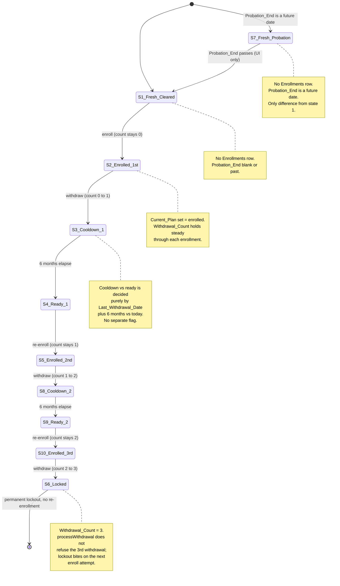

# Enrollment Lifecycle & User States

An employee's Provident Fund status is a small, explicit state machine. The canonical state lives on the **`Enrollments`** sheet (one row per employee who has ever enrolled), with one flag (`Probation_End`) on the **`Users`** sheet and the full action history on the **`Audit_Log`**. `getUserProfile` (`Profile.gs`) reads those sheets, `populateUI` (`JS.html`) maps the result onto one of nine cycle states plus a probation flag, and the cut-off-window logic in `Profile.gs` + `Utils.gs` derives the "in progress / cancellable" view from `Audit_Log`.

This page is the lifecycle view. The rules that *gate* these states (payroll cut-off, match tiers, plan-change lock, vesting, probation) are formalized on [Business Rules & Invariants](/openwiki/concepts/business-rules.md); the sheet columns and JSON-in-a-cell patterns are on [Data Model & Google Sheets Schema](/openwiki/concepts/data-model.md).

## The state model: 9 cycle states + a probation flag

`MIGRATION.md` formalizes the lifecycle as **9 enrollment-cycle states (numbered 1–10, with 6 reserved for the terminal lockout) plus a probation flag** that overlays state 1. The spine of the cycle is `Withdrawal_Count`: it is `0` through the 1st enrollment, `1` through the 2nd, `2` through the 3rd, and `3` at permanent lockout. It holds steady through each enrollment and **ticks up only on a withdrawal**.

| State | Name | `Withdrawal_Count` | `Current_Plan` | `Last_Withdrawal_Date` | `Probation_End` | Enrollments row? |
|---|---|---|---|---|---|---|
| **1** | Fresh, cleared | — | — | — | blank/past | **no row** |
| **7** | Fresh, on probation | — | — | — | **future** | **no row** |
| **2** | Enrolled, 1st | `0` | set | blank | n/a | yes |
| **3** | Withdrawn 1×, in cooldown | `1` | blank | ≤6 mo ago | n/a | yes |
| **4** | Withdrawn 1×, ready | `1` | blank | >6 mo ago | n/a | yes |
| **5** | Enrolled, 2nd | `1` | set | >6 mo ago | n/a | yes |
| **8** | Withdrawn 2×, in cooldown | `2` | blank | ≤6 mo ago | n/a | yes |
| **9** | Withdrawn 2×, ready | `2` | blank | >6 mo ago | n/a | yes |
| **10** | Enrolled, 3rd | `2` | set | >6 mo ago | n/a | yes |
| **6** | Withdrawn 3×, permanently locked | `3` | blank | date of 3rd withdrawal | n/a | yes |

States **1 and 7 have no `Enrollments` row** — they are the only states with no row, and the *only* difference between them is `Users.Probation_End`: a **future** date in state 7 blocks enrollment, while state 1 is cleared to enroll. Probation lives entirely in the `Users` sheet; it is not a column on `Enrollments`. A user in state 7 is resolved by `getUserProfile` exactly like state 1 (no `Enrollments` row found) but with `isOnProbation = true` and `probationEndDate` surfaced for the "Eligible to enroll after …" message.

### State diagram

The nine cycle states and the transitions between them. Probation (state 7) is an overlay on the fresh state — it does not change the `Enrollments` row, only the `Users.Probation_End` flag — so it is shown as a gated variant of state 1.



*The 9 enrollment-cycle states + probation overlay. `Withdrawal_Count` is the spine (0 → 1 → 2 → 3); it ticks only on a withdrawal, holding steady through each enrollment. Cooldown-vs-ready (3↔4, 8↔9) is decided by `Last_Withdrawal_Date + 6 months` relative to today — no separate flag.*

## Per-state field values on the `Enrollments` sheet

`MIGRATION.md` records the exact field values per state. States 1 and 7 have no row. For the rest, `First_Enrolled_Date` is set once on first enrollment and never overwritten; `Current_Enrolled_Date` is the *current cycle's* start and is updated on each (re-)enrollment; `Current_Plan` is the **enrolled flag** (set decimal = enrolled, blank = not enrolled); `Investment_Plan` pairs with it (set when enrolled, blank when not); `Last_Withdrawal_Date` is blank until a withdrawal and drives the cooldown math for counts 1 and 2.

Legend: `D0` = original 1st-enroll date · `D1` = 2nd-enroll (re-enroll) date · `D2` = 3rd-enroll date · `—` = blank.

| State | First_Enrolled_Date | Current_Enrolled_Date | Current_Plan | Investment_Plan | Last_Plan_Change_Date | Withdrawal_Count | Last_Withdrawal_Date |
|---|---|---|---|---|---|---|---|
| **2** Enrolled 1st | `D0` | `D0` | **set** | **set** | `—` (or change date) | `0` | `—` |
| **3** Withdrawn 1×, cooldown | `D0` | `D0` (ended) | **blank** | **blank** | `—` | `1` | **≤6 mo ago** |
| **4** Withdrawn 1×, ready | `D0` | `D0` (ended) | **blank** | **blank** | `—` | `1` | **>6 mo ago** |
| **5** Enrolled 2nd | `D0` | `D1` | **set** | **set** | `—` (or change date) | `1` | **>6 mo ago** |
| **8** Withdrawn 2×, cooldown | `D0` | `D1` (ended) | **blank** | **blank** | `—` | `2` | **≤6 mo ago** |
| **9** Withdrawn 2×, ready | `D0` | `D1` (ended) | **blank** | **blank** | `—` | `2` | **>6 mo ago** |
| **10** Enrolled 3rd | `D0` | `D2` | **set** | **set** | `—` (or change date) | `2` | **>6 mo ago** |
| **6** Withdrawn 3×, locked | `D0` | `D2` (ended) | **blank** | **blank** | `—` | `3` | date of 3rd withdrawal |

`Allstars_ID` is always the employee ID and is omitted from the table for width. `Current_Enrolled_Date` for states 3/4/8/9/6 is a harmless leftover — it is not read while unenrolled — but it **drives tenure / match-tier / 5-year vesting when `Withdrawal_Count >= 1`**, so for states 5 and 10 it must be the re-enroll date `D1`/`D2`, not the original `D0`.

### Two constraints that are easy to get wrong

1. **Cooldown vs ready is decided purely by `Last_Withdrawal_Date`** (`+6 months` vs today) — states 3 vs 4 (`Count = 1`) and 8 vs 9 (`Count = 2`). There is no separate "ready" flag; the date *is* the switch. A real date stored as a string (`"2024-01-15"`) fails `instanceof Date` and silently skips the cooldown logic — a data-type, not a state, bug.
2. **An enrolled re-enrollment's `Last_Withdrawal_Date` must be >6 months ago** — states 5 (`Count = 1`) and 10 (`Count = 2`). A re-enrollment can only happen after the prior cooldown expired, so the date must already be >6 months in the past. Because the UI evaluates cooldown *before* enrolled-status, a recent `Last_Withdrawal_Date` on an enrolled row would wrongly show an enrolled member as "Cooldown".

## How the UI derives the state — the `populateUI` cascade

`populateUI` in `JS.html` does not read the 1–10 state numbers directly; it evaluates a strict, non-commutative cascade over the fields `getUserProfile` returns, and the **first** matching branch sets the status pill and short-circuits the rest:

1. **Permanent lockout** — `withdrawalCount >= 3` → "หมดสิทธิ์ถาวร / Locked" (state 6).
2. **Probation** — `isOnProbation` (a future `Probation_End`) → "ระหว่างทดลองงาน / Probation" (state 7).
3. **Withdrawal cooldown** — `isCoolingDown` (`Count` 1 or 2, within 6 months of `Last_Withdrawal_Date`) → "ระงับสิทธิ์ชั่วคราว / Cooldown" (states 3, 8).
4. **Enrolled** — `isEnrolled` (non-blank `Current_Plan`) → "เป็นสมาชิก ครั้งที่ N / Enrolled #N" (states 2, 5, 10).
5. **Eligible** — default → "มีสิทธิ์สมัครได้ ครั้งที่ N / Eligible #N" (states 1, 4, 9).

The enrolled/eligible branches also surface the **enrollment attempt number** as `withdrawalCount + 1` (so a first-time eligible user is `#1`, a post-cooldown ready user is `#2`/`#3`). The ordering matters: a user who is both on probation and in a withdrawal cooldown sees the probation message, and a user whose `Last_Withdrawal_Date` is recent but who somehow has a non-blank `Current_Plan` is shown as "Cooldown", not "Enrolled".

> **Production-readiness gap:** this cascade runs **client-side only**. The server-side write functions (`processEnrollment`, `processWithdrawal`, `processUpdateBeneficiaries`) do **not** re-validate the probation / cooldown / lockout gates before writing — only `processChangePlan` re-checks the 6-month plan-change lock. Hardening the write paths to re-check these gates server-side is a known item (see [Business Rules](/openwiki/concepts/business-rules.md)).

## What each action does to the `Enrollments` row

The three payroll-cycled actions mutate the `Enrollments` row in place; `First_Enrolled_Date` is the one field set once and never overwritten.

### Enroll (`processEnrollment`)

- **No existing row (states 1, 4, 9):** appends a new row with `First_Enrolled_Date = today`, `Current_Enrolled_Date = today`, `Current_Plan` and `Investment_Plan` set, `Withdrawal_Count = 0` (only if the row is truly new). `wasFirstEnrollment` is `true` only when `First_Enrolled_Date` was empty, which drives the membership-start date in the letter (`Hire_Date` on first enrollment, else `today`).
- **Existing row (re-enroll, states 4, 9):** updates `Current_Enrolled_Date = today`, `Current_Plan`, `Investment_Plan`; leaves `First_Enrolled_Date` untouched (so a blank value on an already-enrolled member causes a wrong-date bug on the next re-enrollment). `Withdrawal_Count` is **not** touched — it holds steady through the enrollment.
- Captures `priorValues` (`First_Enrolled_Date`, `Current_Enrolled_Date`, `Current_Plan`, `Investment_Plan`) into the `SUBMITTED` audit row so a cancel can revert.

### Withdraw (`processWithdrawal`)

- Requires an existing enrolled row (refuses if `findEnrollmentRowIdx` returns -1).
- **Clears** `Current_Plan` and `Investment_Plan` (blank `Current_Plan` is the "not enrolled" signal).
- **Increments** `Withdrawal_Count` (`currentWdCount + 1`) — this is the **only** place the count ticks.
- **Sets** `Last_Withdrawal_Date = today` (the anchor for the next cooldown window).
- Captures `priorValues` (`Withdrawal_Count`, `Current_Enrolled_Date`, `Current_Plan`, `Investment_Plan`) so a cancel restores full membership state (count, dates, plan).
- `processWithdrawal` does **not** refuse the 3rd withdrawal — it simply increments to `3`, so the permanent lockout takes effect on the *next* enroll attempt, not at withdrawal time.

### Change Plan (`processChangePlan`)

- Re-validates the 6-month plan-change lock (the **one** server-side gate actually enforced at write time), measured from `max(Current_Enrolled_Date, Last_Plan_Change_Date)`.
- Sets `Current_Plan = newPlan` and stamps `Last_Plan_Change_Date = today` (which becomes the new anchor for the next 6-month window).
- Does **not** touch `Withdrawal_Count`, `Current_Enrolled_Date`, or `Investment_Plan`.

## Pending and cancellable: derived from `Audit_Log` + the cut-off window

A transaction is **pending/cancellable** only if **all three** hold: its `Action` is in `["Enroll", "Change Plan", "Withdraw"]`, its latest `Event_Type` is `SUBMITTED` (or `EDITED`), and `isWithinEditableWindow(submittedAt)` is true. Beneficiary and investment-plan changes log a `SUBMITTED` row too but are **deliberately excluded** — they are effective immediately (no payroll cut-off, no cancellable state), so they never appear in the in-progress table.

### `getPendingTransactions` — the derivation

`getPendingTransactions(allstarsId)` (`Profile.gs`) derives the in-progress box purely from `Audit_Log` — there is no separate `Pending_Transactions` sheet:

1. Scan the audit log and, **per `Transaction_ID`**, keep the row with the latest `Timestamp` (`new Date(row[timestampCol]) > new Date(userTransactions[txId][timestampCol])`).
2. For each kept row, include it only if `CANCELLABLE_ACTIONS.indexOf(actionType) !== -1` **and** `(eventType === "SUBMITTED" || eventType === "EDITED")` **and** `isWithinEditableWindow(submittedAt)`.
3. Build a human-readable description per action type (`Enroll`/`Change Plan` → `"… to N% plan"`; `Withdraw` → `"Withdrawal from fund"`) and return `{ transactionId, type, description, submittedAt, editableUntil, currentValues: eventData.newValues }`.

The `editableUntil` deadline is the **next upcoming 15th of the month at 23:59:59 Asia/Bangkok** (`getEditableUntil`, `Utils.gs`), computed explicitly in Bangkok time so it is correct regardless of the GAS project's default timezone. `isWithinEditableWindow(submittedAt)` is simply `now < getEditableUntil(submittedAt)`.

### `cancelTransaction` — the revert

`cancelTransaction(transactionId, deviceData)` (`Action.gs`) reverts the affected `Enrollments` fields from the `priorValues` captured at `SUBMITTED` time and appends a `CANCELLED` row with the **same `Transaction_ID`**. It:

1. Finds the `SUBMITTED` row for the `Transaction_ID`; refuses if not found, already `CANCELLED`, not owned by the caller, or outside the editable window (re-checks `isWithinEditableWindow`).
2. Reverts per action type from `priorValues`:
   - **Enroll** → restore `First_Enrolled_Date`, `Current_Enrolled_Date`, `Current_Plan`, `Investment_Plan` (blank if it was a first-ever enrollment — the row may end up cleared).
   - **Change Plan** → restore `Current_Plan` and clear `Last_Plan_Change_Date`.
   - **Withdraw** → restore `Withdrawal_Count`, clear `Last_Withdrawal_Date`, and restore `Current_Plan` + `Investment_Plan` (so a cancelled withdrawal fully restores membership state).
   - Any other action type is rejected ("Action type does not support cancellation").
3. Appends a `CANCELLED` audit row with `Event_Data = { cancelledAt, originalTransactionId, restoredValues }`.

**No penalty side-effects remain** after a cancel: the plan-change lock, the withdrawal count, and the re-enrollment cooldown are all rolled back because they are just `Enrollments` fields, and cancel restores those fields to their pre-submission values. A cancelled `Withdraw` does not leave a `Last_Withdrawal_Date`, so no cooldown persists.

### The `EDITED` event type

<!-- openwiki: broken internal link [/Proposal%20-%20In%20Progress%20Pending%20Transactions.md] file "/Proposal%20-%20In%20Progress%20Pending%20Transactions.md" does not exist. Fix the href or restore the target, then delete this comment. -->
`getPendingTransactions` accepts a latest event of `SUBMITTED` **or** `EDITED`, and `Event_Type` is documented as `SUBMITTED` / `CANCELLED` / `EDITED`. In the current codebase **no handler writes an `EDITED` row** — editing a pending transaction was dropped from the [In Progress Pending Transactions](/Proposal%20-%20In%20Progress%20Pending%20Transactions.md) proposal ("users who want different values cancel and resubmit"). The `EDITED` branch is retained in the filter so a future edit feature slots in without changing the cancellation-window derivation, but today the live lifecycle is `SUBMITTED` → (cancel) → `CANCELLED`, or `SUBMITTED` → window closes → committed.

## Transaction lifecycle in the audit log

A single logical transaction groups one or more audit rows under a shared `Transaction_ID` (prefix `EN-`/`PC-`/`WD-`/`BN-`, a date, and a short random suffix from `generateTransactionId`). `Audit_Log` is append-only: the handler writes a `SUBMITTED` row, `cancelTransaction` appends a `CANCELLED` row with the same ID, and `patchAuditEventData(txId, eventType, extraFields)` is the one operation that mutates an existing row in place — it re-finds the row by `Transaction_ID + Event_Type`, `JSON.parse`s the `Event_Data`, merges in post-commit stamps (`emailSent`, `letterFileId`, …), and writes it back. A full transaction lifecycle is reconstructable by filtering `Audit_Log` on `Transaction_ID` and ordering by `Timestamp`.

<!-- openwiki: mermaid parse failed and this diagram was converted to a text fence so it does not break rendering. Fix the diagram source and restore the mermaid fence. Parser error: Heuristic: a semicolon inside a label breaks rendering; rephrase the label. -->
```text
flowchart TD
    Submit["Action handler writes SUBMITTED row (Transaction_ID, priorValues, newValues)"] --> Patch["patchAuditEventData merges emailSent, letterFileId, ... into Event_Data"]
    Patch --> Window{"isWithinEditableWindow(submittedAt)?"}
    Window -->|"yes, still open"| Pending["getPendingTransactions shows it in the In Progress box"]
    Window -->|"no, window closed"| Committed["entry drops from the box; Enrollments row is the committed state"]
    Pending --> Cancel{"User clicks Cancel"}
    Cancel --> Revert["cancelTransaction reverts Enrollments from priorValues"]
    Revert --> CancelRow["appends CANCELLED row with same Transaction_ID"]
    CancelRow --> Done["no penalty side-effects remain"]

    note right of Pending
      Only Enroll, Change Plan, Withdraw
      are cancellable. Beneficiary and
      investment-plan changes are
      effective immediately and never
      appear here even though they log
      a SUBMITTED row.
    end note
```

*The pending-transaction lifecycle: a `SUBMITTED` audit row is cancellable only while the cut-off window (next 15th, 23:59 Bangkok) is open. Cancel reverts `Enrollments` from `priorValues` and appends a `CANCELLED` row with the same `Transaction_ID`; no penalty side-effects persist.*

## Relationships

- **[Business Rules & Invariants](/openwiki/concepts/business-rules.md)** — the rules that *gate* these states: the payroll cut-off, the 6-month plan-change lock, the 6-month re-enrollment cooldown, the 5-year vesting, the probation block. This page is the *state model*; that page is the *policy*.
- **[Data Model & Google Sheets Schema](/openwiki/concepts/data-model.md)** — the `Enrollments`, `Users`, and `Audit_Log` column schemas, the `Allstars_ID` join key, and the `JSON`-in-a-cell patterns for `Event_Data` and `Beneficiary_Data`.
- **[Data Migration](/openwiki/operations/data-migration.md)** — the pre-go-live consistency checks that the migrated `Enrollments` rows actually land in the intended 1–10 state (every `Count ≥ 1` row has a `Last_Withdrawal_Date`; enrolled re-enrollments have it >6 months ago; date columns are real dates).
