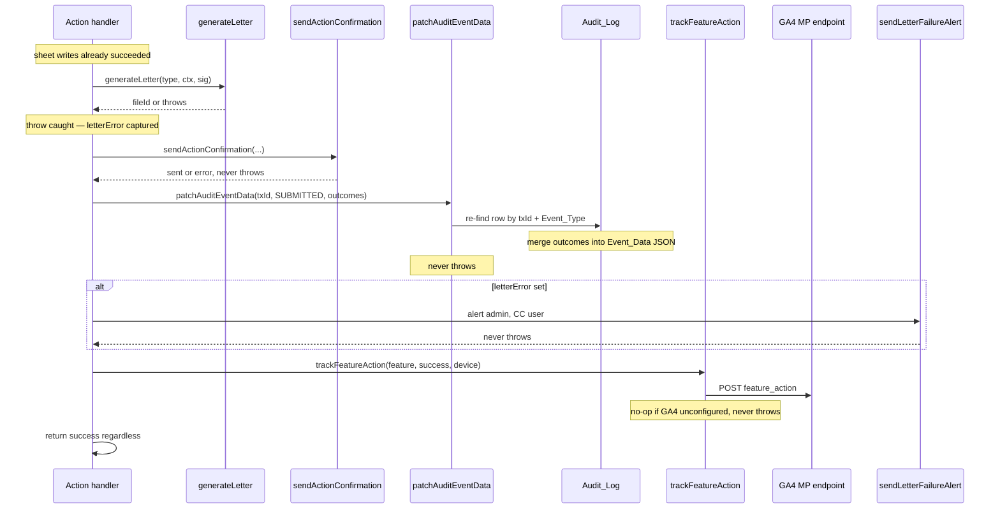

# Confirmation Pipeline — Email, Letters & Analytics

Every action handler (`processEnrollment`, `processChangePlan`, `processUpdateBeneficiaries`, `processWithdrawal`, `cancelTransaction`) does its real work first — resolving the user by `Work_Email`, writing the `Enrollments`/`Beneficiaries` sheets, and appending the `Audit_Log` row. Only **after those writes succeed** does it run the **confirmation pipeline**: a fixed sequence of best-effort side-effects that notify the user, archive a signed PDF, stamp the audit row with the outcomes, and report the event to GA4. The defining invariant is that **none of these side-effects may throw or roll back the action** — the handler returns `{success: true}` even when the email, letter, or analytics call fails. Failures are recorded, not propagated.

## The pipeline

The handler owns the `transactionId` (generated up front via `generateTransactionId`, e.g. `EN-20260602-a1b2`) and threads it through the audit row, the letter context, the email `details`, and the audit patch — so the post-commit outcomes can be matched back to the row the handler just appended.



*The post-commit side-effect sequence. Every arrow after the sheet writes is best-effort; a failure in any step is logged to the audit row or swallowed, never returned to the user.*

The steps in order, for a handler that produces a letter (Enroll, Update Beneficiaries):

1. **`generateLetter`** (`Letter.gs`) — copy a Google Docs template, fill placeholders + signature, export to PDF, archive in Drive. This is the **only** step allowed to throw; the handler wraps it in `try/catch` and captures `letterError`.
2. **`sendActionConfirmation`** (`Email.gs`) — send the bilingual confirmation email, attaching the PDF if `letterFileId` is set. Returns `{sent, error?}` and **never throws**.
3. **`patchAuditEventData`** (`Utils.gs`) — re-find the audit row and merge `letterFileId`/`letterError`/`emailSent`/`emailError`/`signedAt` into its `Event_Data` JSON. **Never throws.**
4. **`sendLetterFailureAlert`** (`Email.gs`) — only if `letterError` is set: alert the admin (CC the user) so a document is followed up. **Never throws.**
5. **`trackFeatureAction`** (`Analytics.gs`) — fire the GA4 `feature_action` event. **Never throws; no-op if GA4 is unconfigured.**

Actions without a letter (Change Plan, Withdraw, Cancel) skip step 1 and 4 and patch only `emailSent`/`emailError`. The `trackFeatureAction("fail", …)` call lives in each handler's outer `catch`, so a handler-level failure is still reported to GA4 even though the pipeline itself was never reached.

## The non-throwing invariant

Every component in the pipeline is defensive by contract:

| Component | May throw? | Failure handling |
|---|---|---|
| `generateLetter` | **Yes** — the only one | handler `try/catch` → `letterError`; `sendLetterFailureAlert` follows |
| `sendActionConfirmation` | No | returns `{sent: false, error}`; caller patches `emailError` |
| `patchAuditEventData` | No | swallows internally; a failed patch is silently lost |
| `sendLetterFailureAlert` | No | returns `{sent: false, error}`; result discarded |
| `trackFeatureAction` / `trackEvent` | No | swallows internally; no-op if GA4 unconfigured |

The handler always reaches `return {success: true}` (or `trackFeatureAction("fail")` + `return {success: false}` in the outer `catch`). A letter/email/analytics failure degrades the *notification* but never the *recorded action* — the enrollment, plan change, or beneficiary update has already been written to the sheet and audited.

## The audit patch mechanism

`patchAuditEventData(transactionId, eventType, extraFields)` is the bridge between the side-effects and the audit row the handler already appended. It re-reads `Audit_Log`, scans **bottom-up** (the row just appended is near the end), matches on **both** `Transaction_ID` **and** `Event_Type`, parses the existing `Event_Data` JSON string, merges the `extraFields` keys in, and writes the merged JSON back to that cell. If any of the three columns is missing, or the row can't be found, or anything throws, it swallows and returns — the action is already committed.

The merged fields are the post-commit outcomes the audit row needs to tell the full story:

- `letterFileId` — Drive file id of the archived PDF, or `null` if generation failed.
- `letterError` — the caught exception string, or `null` if the letter succeeded.
- `emailSent` — boolean from `sendActionConfirmation`.
- `emailError` — the email error string, or `null`.
- `signedAt` — the timestamp if a signature was provided (`sigDataUrl ? today : null`), else `null`.

For Change Plan / Withdraw / Cancel (no letter), only `emailSent` and `emailError` are patched. The `CANCELLED` event reuses the **original** `Transaction_ID` for continuity with its `SUBMITTED` row, and `patchAuditEventData` is called with `"CANCELLED"` so it patches the cancellation row, not the submission row.

## The signed PDF letter

`generateLetter(type, ctx, sigDataUrl)` in `Letter.gs` builds the archive copy of the user's signed confirmation. It is the pipeline component **allowed to throw** — and the caller's `try/catch` is what makes the pipeline safe.

The flow: read the template id from config (throwing a clear error if `PF_ENROLLMENT_TEMPLATE_ID` is unset), copy the Google Docs template into the target folder, open the copy, fill `{{placeholders}}` via `fillPlaceholders`, render the beneficiary list into `{{beneficiary_table}}`, insert the signature PNG into every `{{signature_image}}` paragraph (scaled to fit a 220×80 point box, aspect preserved, never upscaled), `saveAndClose`, export the Doc as a PDF, and **trash the intermediate Doc** in a `finally` block so orphan Docs never survive an export failure. It returns `{fileId, fileUrl, fileName}` for the email attachment.

Two letter types share one function:

- `"ENROLLMENT"` — the full letter (rate, employer match, investment, member-since, effective payroll month).
- `"BENEFICIARY"` — falls back to `PF_ENROLLMENT_TEMPLATE_ID` when `PF_BENEFICIARY_TEMPLATE_ID` is unset; the enrollment-only placeholders (rate/match/investment/member-since) render blank for a beneficiary letter.

## The confirmation email

`sendActionConfirmation(p)` sends a **bilingual (Thai-first, then English)** plain-text + HTML email to the acting user. It builds the per-action detail lines via `buildEmailContent(actionType, eventType, details)`, formats the submitted-at timestamp in `Asia/Bangkok`, resolves the web-app URL (best-effort — empty if not deployed as a web app), attaches the PDF when `attachmentFileId` is set, and calls `MailApp.sendEmail`. Any failure is caught and returned as `{sent: false, error}` — the email never throws.

### The cancel-line rule

The email shows a *"To cancel this request, please visit the application."* line **only** for `SUBMITTED` events of **cancellable** actions:

```
const CANCELLABLE = ["Enroll", "Change Plan", "Withdraw"];
const showCancelLine = p.eventType === "SUBMITTED" && CANCELLABLE.indexOf(p.actionType) !== -1;
```

`Update Beneficiaries` is effective immediately (no pending state, no cancellation window), so its `SUBMITTED` email **never** promises a cancel option. `CANCELLED` event emails never show the cancel line either. In the HTML body the cancel line is paired with an "Open application" button linking to the web-app URL when one is resolvable.

## The letter-failure admin alert

When `generateLetter` throws but the action itself succeeded, the handler calls `sendLetterFailureAlert` so a human follows up on the missing document. The alert goes to the admin (`navananyeamsiri@airasia.com`) and **CCs the acting user** — both sides know a document is owed. The body states explicitly that the user's action was recorded normally and only the PDF failed, with the transaction id, action type, time, and raw error for diagnostics. Like `sendActionConfirmation`, it never throws; its result is discarded.

## GA4 adoption analytics

`trackFeatureAction(feature, outcome, deviceData)` and `trackAppOpen(deviceData)` send server-side events to the GA4 **Measurement Protocol** (`/mp/collect`). Server-side is deliberate: the GAS web app renders in a sandboxed `googleusercontent.com` iframe where GA's third-party cookies are often blocked, so client-side `gtag.js` can't reliably track users/sessions/returning visitors. Server-side knows the user and sets a stable (hashed) `user_id`, so returning-vs-new works despite the iframe cookie problem.

### PDPA: hashed user_id

The GA4 `user_id` is `SHA-256(salt + email)` via `hashUserId_` — **never** the raw email or `Allstars_ID`. An optional `GA4_USER_ID_SALT` (Script Property) makes the hash non-reversible by rainbow table; any hash→identity mapping is kept internal. `currentUserHash_` resolves the active user's email defensively (never throws, returns `""` if no email).

### Low-cardinality device buckets

`parseDevice_(ua)` reduces the raw `navigator.userAgent` string into three reportable buckets — `device_category` (`desktop`/`mobile`/`tablet`), `device_os` (`iOS`/`Android`/`Windows`/`macOS`/`Linux`/`Other`), and `device_browser` (`Edge`/`Opera`/`Samsung`/`Firefox`/`Chrome`/`Safari`/`Other`) — which must be **registered as GA4 custom dimensions** to appear in reports. The raw UA is never sent (it's thousands of distinct strings, useless in reports). Native GA4 device detection is useless here because the hits are sent server-side via `UrlFetchApp`, so GA4 sees Google's datacenter UA/IP, not the user's — these explicit params are the only reliable device signal. The `" | WxH"` screen-size suffix appended client-side is ignored by `parseDevice_`.

### `app_open` is fired client-side

`trackAppOpen` is called from `html/JS.html` `DOMContentLoaded` (not from `doGet`), because `doGet` runs server-side and cannot see the browser `User-Agent`. The client forwards `navigator.userAgent + ' | ' + screen.width + 'x' + screen.height`; `parseDevice_` strips the screen suffix. `DOMContentLoaded` fires once per real page load — the post-action home re-render is a soft re-render, so `app_open` doesn't double-count.

### `feature_action` and the MP gotchas

`trackFeatureAction(feature, outcome, deviceData)` merges `{feature, outcome}` with the device buckets and posts a `feature_action` event. `feature` is one of `enroll`/`change_plan`/`withdraw`/`beneficiary`/`cancel`; `outcome` is `success` or `fail`. `trackEvent` adds `engagement_time_msec: "100"` and a `session_id` so the hit registers as an active session in GA4 (a common MP gotcha: without them, server events often don't count toward users/sessions). `client_id` reuses the hashed `user_id` (there's no reliable browser id in the iframe), and `user_id` is set when resolvable to enable returning-vs-new. If `GA4_MEASUREMENT_ID` or `GA4_API_SECRET` is unset, `trackEvent` returns immediately — the entire analytics layer is a **silent no-op until configured**, so the app runs fine before GA4 is wired.

## Per-handler pipeline variations

| Handler | Letter? | Email event | Patches | Analytics feature |
|---|---|---|---|---|
| `processEnrollment` | `ENROLLMENT` | `Enroll` / `SUBMITTED` | letter + email + `signedAt` | `enroll` |
| `processChangePlan` | — | `Change Plan` / `SUBMITTED` | email only | `change_plan` |
| `processUpdateBeneficiaries` | `BENEFICIARY` | `Update Beneficiaries` / `SUBMITTED` | letter + email + `signedAt` | `beneficiary` |
| `processWithdrawal` | — | `Withdraw` / `SUBMITTED` | email only | `withdraw` |
| `cancelTransaction` | — | `<action>` / `CANCELLED` | email only | `cancel` |

Change Plan, Withdraw, and Cancel send no letter and therefore never trigger `sendLetterFailureAlert`. The `CANCELLED` email reuses the original `Transaction_ID` and references the cancelled action type; it states no changes were applied (vesting and other detail are intentionally omitted — vesting is acknowledged in the pre-submit modal).

## Configuration (Script Properties)

All pipeline configuration lives in **Script Properties** (Project Settings → Script Properties), never in source. Unconfigured values are empty strings and produce silent no-ops, so the app runs before any of these are wired:

| Property | Owner | Used for | Unconfigured behavior |
|---|---|---|---|
| `PF_ENROLLMENT_TEMPLATE_ID` | `Letter.gs` | enrollment + beneficiary letter template | `generateLetter` throws `PF_ENROLLMENT_TEMPLATE_ID is not set` |
| `PF_BENEFICIARY_TEMPLATE_ID` | `Letter.gs` | beneficiary letter template (optional) | falls back to enrollment template |
| `PF_LETTERS_FOLDER_ID` | `Letter.gs` | Drive folder for archived PDFs (optional) | falls back to the template's parent folder |
| `GA4_MEASUREMENT_ID` | `Analytics.gs` | GA4 stream id | `trackEvent` no-ops |
| `GA4_API_SECRET` | `Analytics.gs` | Measurement Protocol API secret | `trackEvent` no-ops |
| `GA4_USER_ID_SALT` | `Analytics.gs` | salt for the `user_id` hash (optional) | hash uses empty salt |

## Related pages

- **[Bilingual i18n](/openwiki/concepts/bilingual-i18n.md)** — the Thai-first/then-English convention shared by the email body, the letter, and the `REL_LABELS`/`getEffectiveMonthLabel` helpers.
- **[Data model](/openwiki/concepts/data-model.md)** — the `Audit_Log` schema, `Event_Data` JSON-in-a-cell, and the `Allstars_ID`/`Transaction_ID` keys the patch matches on.
- **[Deployment & configuration](/openwiki/operations/deployment-config.md)** — the Script Properties config surface and the `clasp` push workflow.
- **[Beneficiary flow](/openwiki/workflows/beneficiary-flow.md)** — the `processUpdateBeneficiaries` handler end-to-end, including its letter + email + alert pipeline.
- **[Enrollment flow](/openwiki/workflows/enrollment-flow.md)** — the enrollment wizard and `processEnrollment` handler.
