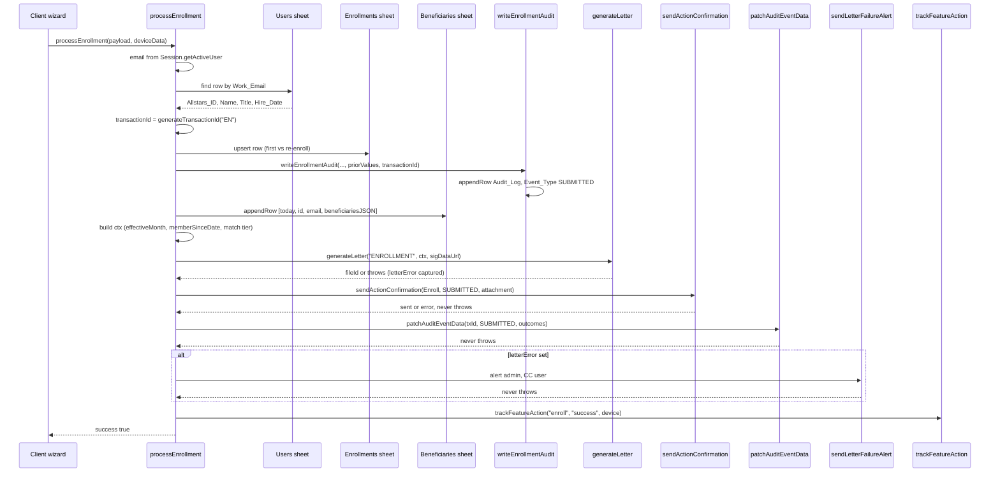

# Enrollment Flow

Enrollment is the action that moves an employee from "eligible" into an enrolled membership state. It is driven by a 5-step client-side wizard (`html/JS.html`) that collects the contribution rate, investment plan, beneficiaries, a review, and a drawn signature, then submits to `processEnrollment` (`Code/Action.gs`). The server resolves the user by email, upserts the `Enrollments` row (first enrollment vs re-enrollment differ only in `First_Enrolled_Date`), appends a `Beneficiaries` ledger row, and runs the fixed best-effort confirmation pipeline: generate a signed PDF letter, send the confirmation email, patch the audit row with the outcomes, and report to GA4. The transaction id (`EN-YYYYMMDD-xxxx`) is minted by the handler and threads through the audit row, the letter, the email, and the audit patch so every artifact of one submission is joinable.

The lifecycle states this flow moves between, the `Withdrawal_Count` spine, and the probation/cooldown gates that *frame* eligibility are on [Enrollment Lifecycle & User States](/openwiki/concepts/enrollment-lifecycle.md). The payroll cut-off, employer-match tiers, and beneficiary validation rules are on [Business Rules & Invariants](/openwiki/concepts/business-rules.md). The post-commit side-effect discipline shared by every action handler is on [Confirmation Pipeline](/openwiki/workflows/confirmation-pipeline.md); the beneficiary edit flow (which reuses the same wizard fragments) is on [Beneficiary Flow](/openwiki/workflows/beneficiary-flow.md).

## The 5-step wizard (client)

`openEnroll()` resets `wizData` to `{ contribution: null, investment: null, beneficiaries: [{ prefix, name, rel, pct: 100, address }] }`, sets `currentStep = 1`, destroys any stale signature pad, and shows the full-screen `#enrollWizard` overlay. `updateWizardUI()` shows one `wizStep1`–`wizStep5` container at a time, toggles the Back button's visibility, and swaps the Next button label to "ยืนยันการสมัคร / Submit" on step 5. `wizardNext()` advances the step or, on step 5, calls `submitEnrollWizard()`.

| Step | Collects | Gate (`validateStep`) |
|---|---|---|
| 1 | Contribution rate (`selectContribution`) | `wizData.contribution !== null` |
| 2 | Investment plan (`selectInvestment`) | `wizData.investment !== null` |
| 3 | Beneficiaries (1–5) | every card has prefix, non-blank name, `rel`, non-blank address, `pct ≥ 1`; **sum exactly 100** |
| 4 | Review summary (`renderSummary`) | always valid |
| 5 | Drawn signature (`mountWizSignature`) | `!PFSignature.isEmpty(wizSigHandle)` |

The Next button is disabled until the current step's gate passes; on step 3 the helper message distinguishes "exceeds 100%" from "must equal exactly 100%". Step 4 renders the contribution %, investment plan, the beneficiary list, and the effective-date banner (`effectiveDateBannerHTML()`), which shows the payroll month the deduction first applies to — `withinCutoff` if today is ≤15th, else the next month.

### Beneficiary cards and the title prefix

Step 3 (`renderBeneficiaries`) renders up to 5 cards (`addBeneficiary` refuses beyond 5 and hides the Add button; `removeBeneficiary` is hidden on card 0). Each card has a title-prefix dropdown, a name input, a relationship dropdown, a percentage, an address textarea, and — for cards after the first — a "ที่อยู่เดียวกัน / Same as Above" checkbox that copies the previous card's address. The prefix is a **transient UI-only field**: at submit, `mergePrefixes` folds `{ prefix, name, ... }` into `{ name: "prefix name", ... }`, so the stored JSON model stays `{ name, rel, pct, address }`. These fragments (`prefixOptions`, `relOptions`, `mergePrefixes`, `splitPrefix`, `PREFIX_LIST`) are shared with the beneficiary manager.

### Signature capture (step 5)

`mountWizSignature()` destroys any prior pad and mounts a fresh one on `#wizSigCanvas` with `validateStep` as the `endStroke` callback, so the Submit button re-enables as soon as anything is drawn. The pad is the shared `window.PFSignature` helper (`html/JS_Signature.html`): a thin handle-based wrapper over the `signature_pad` library, Hi-DPI aware, dark-blue ink, transparent background. `PFSignature.getDataUrl(handle)` returns a PNG data URL **auto-trimmed to the ink's bounding box** (scanning the alpha channel in device pixels) so a small corner signature exports tight; it falls back to the full-canvas export if the trim fails. `closeWizard` and `openEnroll` both call `PFSignature.destroy` to avoid listener leaks. The wizard owns its own pad handle (`wizSigHandle`); the beneficiary manager owns a separate `benSigHandle`.

### Submit

`submitEnrollWizard()` builds the payload and calls the server:

```js
const payload = {
  contributionPlan: parseFloat(wizData.contribution),
  investmentPlan: wizData.investment,
  beneficiariesJSON: JSON.stringify(mergePrefixes(wizData.beneficiaries)),
  sigDataUrl: PFSignature.getDataUrl(wizSigHandle)
};
google.script.run.withSuccessHandler(...).withFailureHandler(...)
  .processEnrollment(payload, navigator.userAgent);
```

On success the wizard closes and a toast shows "สมัครสมาชิกสำเร็จ! / Enrollment Successful!"; `pendingFeedbackAction = 'Enroll'` triggers the post-action feedback prompt on the next home reload. On failure the response `msg` is alerted.

## `processEnrollment` (server)



*The enrollment control flow: the client wizard submits to `processEnrollment`, which resolves the user, mints the transaction id, upserts the Enrollments row with the audit write, appends the Beneficiaries ledger, then runs the best-effort post-commit pipeline (letter → email → audit patch → letter-failure alert → analytics). Every arrow after the sheet writes is best-effort; a failure is recorded, not propagated.*

### 1. Resolve the user

`Session.getActiveUser().getEmail()` is matched case-insensitively against the `Work_Email` column of the `Users` sheet. The matched row yields `Allstars_ID`, `Name_English`, `Business_Title`, and `Hire_Date` — the last three feed the letter context. A missing email returns `{ success: false, msg: "Email not detected" }`; a user not found in `Users` returns `{ success: false, msg: "User not found: <email>" }`.

### 2. Mint the transaction id

`generateTransactionId("EN")` produces `EN-YYYYMMDD-<4-char-random>` (date in GMT). The id is **owned by the handler** and is threaded into four places so they can be joined back to one submission: the `Audit_Log` row (via `writeEnrollmentAudit`), the letter context (`ctx.transactionId`), the email `details.transactionId`, and the `patchAuditEventData` call that stamps the post-commit outcomes back onto that same audit row.

### 3. Upsert the `Enrollments` row (first vs re-enroll)

`findEnrollmentRowIdx(enrollData, allstarsId)` scans the `Enrollments` sheet for a matching `Allstars_ID` (1-indexed row, or `-1`). Two branches:

- **Re-enroll (row exists):** `wasFirstEnrollment` is `true` only if the existing `First_Enrolled_Date` is blank; in that case `First_Enrolled_Date` is set to `today`. `Current_Enrolled_Date` is **always** set to `today`. `Current_Plan` and `Investment_Plan` are overwritten with the submitted values. `priorValues` captures the pre-write `First_Enrolled_Date`, `Current_Enrolled_Date`, `Current_Plan`, `Investment_Plan` for the audit.
- **First enroll (no row):** a new row is appended with `First_Enrolled_Date = today`, `Current_Enrolled_Date = today`, `Current_Plan`, `Investment_Plan`, and `Withdrawal_Count = 0`. `wasFirstEnrollment = true`; `priorValues` are all blank.

The `Investment_Plan` column is a hard schema guard: if the column header is missing, the handler returns `{ success: false, msg: "Admin Error: Missing 'Investment_Plan' column in Enrollments sheet." }` before any write. `writeEnrollmentAudit` is called in **both** branches, appending the `Audit_Log` row with `Action = "Enroll"`, `Event_Type = "SUBMITTED"`, the `Transaction_ID`, and an `Event_Data` JSON carrying `priorValues` + `newValues` (the new `Current_Enrolled_Date`, `Current_Plan`, `Investment_Plan`, and parsed `Beneficiaries`).

> **First vs re-enroll, restated:** `First_Enrolled_Date` is written **only when it was blank** (`wasFirstEnrollment`); it is never overwritten on a subsequent enrollment. `Current_Enrolled_Date` is written to `today` on **every** enrollment, first or re. This is the invariant that makes `First_Enrolled_Date` the immutable membership-start and `Current_Enrolled_Date` the current cycle's start.

### 4. Append the `Beneficiaries` ledger

`ss.getSheetByName("Beneficiaries").appendRow([today, allstarsId, email, beneficiariesJSON])`. The ledger schema is `Timestamp | Allstars_ID | Work_Email | Beneficiary_Data` — append-only, one row per submission, so the prior set survives as the previous row. A missing `Beneficiaries` sheet is a hard failure (`{ success: false, msg: "Admin Error: Missing 'Beneficiaries' sheet." }`).

### 5. Build the letter context

The `ctx` object drives the `{{placeholders}}` in the Google Docs letter template:

- `nameEn`, `allstarsId`, `businessTitle`, `workEmail` — from the `Users` row.
- `hireDate` — `Hire_Date` formatted `dd MMM yyyy` in `Asia/Bangkok`.
- `memberSinceDate` — **`Hire_Date` on first enrollment, `today` on re-enroll** (`wasFirstEnrollment ? userHireDate : today`). This mirrors the `getUserProfile` tenure basis: tenure is measured from hire on the first enrollment and from the re-enrollment date after a withdrawal.
- `planPct` — `(contributionPlan * 100).toFixed(0) + "%"`.
- `employerMatchPct` — `calculateMatchTier(tenureYears)`, where `tenureYears` is computed **only when `wasFirstEnrollment && userHireDate instanceof Date`**; otherwise it is `0`, yielding the lowest `3%` tier. (The dashboard's `getUserProfile` does the fuller tenure-from-`memberSinceDate` computation; the letter only needs the first-enrollment tier.)
- `investmentPlan` — the submitted plan.
- `effectiveMonth` — `getEffectiveMonthLabel(today)`: a bilingual `{ th, en }` payroll month. The cut-off is `day > 15` in `Asia/Bangkok`: submitted ≤15th → this month, ≥16th → next month. The same value is passed to the email `details.effectiveMonth`, so the letter and the email agree.
- `transactionId` — the handler-minted id.
- `beneficiaries` — `JSON.parse(beneficiariesJSON)`, with a `try/catch` fallback to `[]`.

### 6–10. Best-effort post-commit side-effects

After the sheet writes + audit row are committed, the handler runs the confirmation pipeline (see [Confirmation Pipeline](/openwiki/workflows/confirmation-pipeline.md) for the cross-cutting contract):

1. **`generateLetter("ENROLLMENT", ctx, payload.sigDataUrl)`** — the only step allowed to throw. The handler wraps it in `try/catch` and captures `letterError`; `letterFileId` is the resulting PDF's Drive file id. The `sigDataUrl` is decoded from its base64 data URL and inserted into every `{{signature_image}}` paragraph, scaled to fit a 220×80 point box (aspect preserved, never upscaled). The intermediate Google Doc is trashed in a `finally` block.
2. **`sendActionConfirmation({ actionType: "Enroll", eventType: "SUBMITTED", details: { planPct, investmentPlan, effectiveMonth, transactionId }, attachmentFileId: letterFileId })`** — the bilingual confirmation email, with the PDF attached when `letterFileId` is set. Never throws; returns `{ sent, error? }`. Because `Enroll` is in the `CANCELLABLE` list, the email body includes the "visit the app to cancel" line.
3. **`patchAuditEventData(transactionId, "SUBMITTED", { letterFileId, letterError, emailSent: emailResult.sent, emailError, signedAt })`** — re-finds the audit row by `Transaction_ID` + `Event_Type` (bottom-up) and merges the outcomes into its `Event_Data` JSON. `signedAt` is `payload.sigDataUrl ? today : null` — the signature data URL is the signal that the submission was signed. Never throws.
4. **`sendLetterFailureAlert`** — only if `letterError` is set: emails the admin (CC the user) noting the action was recorded but only the PDF failed. Never throws.
5. **`trackFeatureAction("enroll", "success", deviceData)`** — fires the GA4 `feature_action` event. No-op if GA4 is unconfigured; never throws.

The handler then returns `{ success: true }`. The outer `catch` calls `trackFeatureAction("enroll", "fail", deviceData)` and returns `{ success: false, msg }`, so a handler-level failure is still reported to analytics even though the pipeline was never reached.

## The `sigDataUrl` thread

The signature data URL originates in the client's step 5 (`PFSignature.getDataUrl(wizSigHandle)`), travels in the `payload.sigDataUrl` field through `google.script.run.processEnrollment`, and is consumed in two places server-side:

- **The PDF letter** — `generateLetter("ENROLLMENT", ctx, payload.sigDataUrl)` decodes the base64 PNG and embeds it where the template's `{{signature_image}}` markers sit. If `sigDataUrl` is null/empty, the marker paragraph is cleared but no image is inserted (the letter still generates).
- **The `signedAt` audit stamp** — `patchAuditEventData` records `signedAt = payload.sigDataUrl ? today : null`, so the audit row records whether the submission carried a signature and when. The signature is gated client-side (the Submit button is disabled while the pad is empty), so a null `sigDataUrl` only reaches the server if the gate was bypassed.

## Failure semantics

The enrollment writes (Enrollments upsert, Beneficiaries ledger, Audit_Log row) are the **committed state**: once they succeed, the user is enrolled. The letter, email, and analytics are **notifications about that state** and are best-effort — a `generateLetter` throw, a `sendActionConfirmation` failure, or a GA4 outage degrades the notification but never rolls back the enrollment. The audit patch records *which* notifications succeeded/failed (`letterFileId`, `letterError`, `emailSent`, `emailError`, `signedAt`), and the letter-failure alert surfaces a missing PDF to the admin so a document can be followed up. The only hard failures that return `{ success: false }` before any write are: missing email, user not found in `Users`, and the missing `Investment_Plan` column / missing `Beneficiaries` sheet schema errors.
