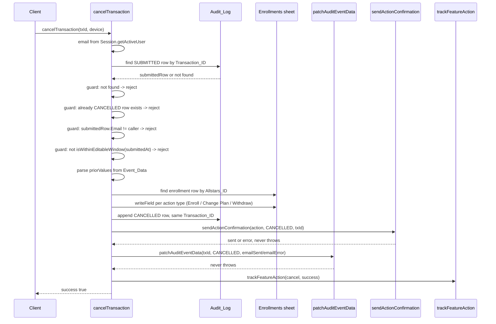

# Plan Change, Withdrawal & Cancel

Three write-path actions live alongside `processEnrollment` in `Code/Action.gs` and `Code/Withdraw.gs`: **change a contribution %**, **withdraw from the fund**, and **cancel a pending transaction**. They share the same scaffolding as the enrollment handler — resolve the user by `Work_Email`, mint a prefixed `Transaction_ID`, write the `Enrollments` row, append a `SUBMITTED`/`CANCELLED` `Audit_Log` row, then run the best-effort confirmation pipeline (email, audit patch, analytics) — but each carries its own domain gate and its own set of fields to mutate. This page covers the three handlers and the in-progress box that ties cancellable submissions to the cancel handler.

The rules that *frame* these actions (the payroll cut-off, the 6-month plan-change lock, the withdrawal-count spine, the 5-year vesting display) are formalized on [Business Rules & Invariants](/openwiki/concepts/business-rules.md); the lifecycle states and the `Audit_Log`-derived pending/cancellable model are on [Enrollment Lifecycle & User States](/openwiki/concepts/enrollment-lifecycle.md); the post-commit side-effect discipline shared by every handler is on [Confirmation Pipeline](/openwiki/workflows/confirmation-pipeline.md); the enrollment handler itself is on [Enrollment Flow](/openwiki/workflows/enrollment-flow.md).

## The 6-month plan-change lock

A member may change their contribution % **once per 6 months**. The lock is measured from `max(Last_Plan_Change_Date, Current_Enrolled_Date)` — whichever of the most recent plan change and the current enrollment date is later. If `today` is before that anchor plus 6 months, the change is rejected.

The lock is evaluated at two points, and the second is the one that actually protects the write:

1. **`checkPlanChangeEligibility()`** (`Action.gs`) — called on page load (`JS.html` `DOMContentLoaded`) and again after every successful action's home-reload. It reads `Last_Plan_Change_Date` and `Current_Enrolled_Date` from the `Enrollments` row, coerces each to a `Date` (falling back to `new Date(0)` when blank or not a date), takes `Math.max` of the two, adds 6 months, and returns `{ locked: true, nextDate }` if `today` is before that date — otherwise `{ locked: false }`. The frontend stores this in `planChangeStatus` and `openChangePlan` uses it to render the locked vs. selectable variant of the change-plan modal.

2. **`processChangePlan(newPlan, deviceData)`** (`Action.gs`) — the server-side write **re-validates the same lock** before writing. It re-derives `mostRecentAction` from `max(lastChangeDate, enrollDate)`, adds 6 months, and returns a bilingual failure with the next-eligible date if the window hasn't opened:

   ```js
   if (today.getTime() < nextEligibleDate.getTime()) {
     return { success: false, msg: `… Cannot change plan. You can change your plan again on: ${nextEligibleDate.toLocaleDateString('en-GB')}` };
   }
   ```

   This is the one server-side gate actually enforced at write time — unlike the probation/cooldown/lockout gates, which are client-side only (see [Business Rules](/openwiki/concepts/business-rules.md) §"Production-readiness gap").

The lock applies **only to contribution %**. Investment-plan changes and beneficiary updates are not throttled by it (and are not payroll-cycled, so they take effect immediately and have no cancellable pending state).

### `processChangePlan` — the write

On success, the handler upserts exactly two `Enrollments` fields:

- `Current_Plan = newPlan` (the new contribution %).
- `Last_Plan_Change_Date = today` — which becomes the **new anchor** for the next 6-month window. The lock is self-reinforcing: every successful change pushes the next-eligible date 6 months forward.

It does **not** touch `Withdrawal_Count`, `Current_Enrolled_Date`, or `Investment_Plan`. Before writing it captures the prior state into the audit row so a later cancel can revert:

```js
const priorValues = { "Current_Plan": priorPlan, "Last_Plan_Change_Date": priorLastChangeDate };
```

It mints a `PC-YYYYMMDD-xxxx` transaction id (`generateTransactionId("PC")`), appends a `SUBMITTED` `Audit_Log` row with `Action: "Change Plan"`, `Event_Data: { priorValues, newValues: { Current_Plan, Last_Plan_Change_Date } }`, then runs the best-effort confirmation pipeline — no letter (Change Plan produces no PDF), a `Change Plan` / `SUBMITTED` email carrying `oldPct`, `newPct`, and the effective payroll month, a `patchAuditEventData` stamp of `emailSent`/`emailError`, and `trackFeatureAction("change_plan", …)`. The pipeline never throws; a failure is recorded, not propagated.

### The two lock-evaluation copies must agree

`checkPlanChangeEligibility` and `processChangePlan` both compute `max(lastChangeDate, enrollDate) + 6 months` independently. The pre-computed `planChangeStatus` only drives the modal UI (locked variant vs. selectable variant); the write-time refusal comes from `processChangePlan` re-deriving the same math. A stale `planChangeStatus` (e.g. the user keeps the page open past the unlock date) is harmless — the modal would show "locked" but the server would accept the change, or vice versa the server re-validates regardless.

## `processWithdrawal` — clearing the plans and ticking the count

`processWithdrawal(deviceData)` (`Code/Withdraw.gs`) is the action that moves a member out of an enrolled state. It requires an existing enrolled row (refuses with `"You are not currently enrolled."` if `findEnrollmentRowIdx` returns `-1`) and then mutates four `Enrollments` fields:

1. **Clears `Current_Plan`** — a blank `Current_Plan` is the "not enrolled" signal the UI cascade reads.
2. **Clears `Investment_Plan`** (only if the column exists — `invCol !== -1`).
3. **Sets `Last_Withdrawal_Date = today`** — the anchor for the next 6-month cooldown window.
4. **Increments `Withdrawal_Count`** (`currentWdCount + 1`) — the **only** place in the codebase the count ticks. It holds steady through every enrollment and only moves on a withdrawal.

The handler captures the pre-write state into the audit row's `priorValues` so a cancel can fully restore membership:

```js
"priorValues": { "Withdrawal_Count": priorWdCount, "Current_Enrolled_Date": priorEnrDate,
                 "Current_Plan": priorPlan, "Investment_Plan": priorInvestment }
```

It mints a `WD-YYYYMMDD-xxxx` transaction id, appends a `SUBMITTED` `Audit_Log` row (`Action: "Withdraw"`), then runs the confirmation pipeline — no letter, a `Withdraw` / `SUBMITTED` email whose effective month is framed as the **final** contribution month (`"Final contribution deducted"`), a `patchAuditEventData` stamp, and `trackFeatureAction("withdraw", …)`.

### The 3rd withdrawal is not refused

`processWithdrawal` does **not** check `Withdrawal_Count >= 3` before writing. It simply increments to `3`, so the **permanent lockout takes effect on the next enroll attempt**, not at withdrawal time. The `populateUI` cascade in `JS.html` checks `withdrawalCount >= 3` first and shows "หมดสิทธิ์ถาวร / Locked"; the server-side write path has no such gate (see [Business Rules](/openwiki/concepts/business-rules.md) §"The 3rd withdrawal — permanent lockout").

### The 5-year vesting check is display-only

The withdrawal modal (`html/JS_Withdraw.html#openWithdraw`) reads `globalUserProfile.tenureY` and renders two eligibility rows: the employee's **own contributions + returns** (always green, fully vested) and the **employer match + returns** (green if `tenureY >= 5`, red with "requires 5 years membership" otherwise). This is a **display rule only** — it communicates what the member is entitled to; it does **not** gate whether `processWithdrawal` accepts the request. The actual payout calculation is handled outside the app. Note that `tenureY` is the whole-years value from `getUserProfile`, which (per the membership-start rule) is measured from `Current_Enrolled_Date` on a re-enrollment after a withdrawal — so a member who withdrew and re-enrolled restarts the vesting clock.

## `cancelTransaction` — reverting inside the editable window

`cancelTransaction(transactionId, deviceData)` (`Code/Action.gs`) is the revert path for the three payroll-cycled actions. It finds the `SUBMITTED` `Audit_Log` row for the given `Transaction_ID`, re-checks the authorization and window guards, reverts the affected `Enrollments` fields from the `priorValues` captured at submit time, and appends a `CANCELLED` row with the **same `Transaction_ID`**.

### Guards (in order)

1. **Email present** — `Session.getActiveUser().getEmail()` must resolve; else `"Email not detected"`.
2. **Audit_Log has the Phase 1 columns** (`Transaction_ID`, `Event_Type`, `Event_Data`); else an admin error.
3. **SUBMITTED row exists** for this `Transaction_ID`; else `"Transaction not found."`
4. **Not already cancelled** — if any row with this id has `Event_Type === "CANCELLED"`, refuse with `"Transaction already cancelled."` This is the **already-cancelled guard**: a transaction can be cancelled exactly once.
5. **Authorization** — the `Email` on the SUBMITTED row must match the caller's email (case-insensitive, trimmed); else `"Not authorized to cancel this transaction."` A user can only cancel their own submissions.
6. **Editable window still open** — `isWithinEditableWindow(submittedAt)` must hold; else `"The cancellation window has closed."`
7. **Action type is cancellable** — only `Enroll`, `Change Plan`, and `Withdraw` have a revert branch; any other action returns `"Action type does not support cancellation."`

### The revert — per action type

The handler parses `priorValues` out of the SUBMITTED row's `Event_Data` JSON and writes each field back via a `writeField(fieldName, value)` helper that looks up the column index by header name and skips silently if the column is missing. The revert set per action:

| Action | Fields reverted from `priorValues` |
|---|---|
| **Enroll** | `First_Enrolled_Date`, `Current_Enrolled_Date`, `Current_Plan`, `Investment_Plan` (blank if the enrollment was the first ever — the row may end up cleared) |
| **Change Plan** | `Current_Plan`, `Last_Plan_Change_Date` |
| **Withdraw** | `Withdrawal_Count` (restored to prior count), `Last_Withdrawal_Date` (cleared to `""`), `Current_Plan`, `Investment_Plan` |

The `prior(fieldName, fallback)` helper falls back when a prior value is `undefined` or `null` — so a missing key in an older audit row degrades gracefully rather than writing `undefined` into a cell.

### The CANCELLED audit row

After the revert, the handler appends a `CANCELLED` row to `Audit_Log` with the **same `Transaction_ID`** as the SUBMITTED row it reverts. The `Event_Data` carries `{ cancelledAt, originalTransactionId, restoredValues }` — `restoredValues` is the map of fields it actually wrote back (so the cancel is self-documenting). It then runs the confirmation pipeline: no letter, a `<action>` / `CANCELLED` email reusing the original `Transaction_ID` for continuity with the SUBMITTED email, a `patchAuditEventData(transactionId, "CANCELLED", …)` stamp (note the `"CANCELLED"` event type — so the patch targets the cancellation row, not the submission row), and `trackFeatureAction("cancel", …)`.



*The cancel control flow: four guards (found, not-already-cancelled, authorized, within window) run before any write; the revert writes per action type, then a CANCELLED row is appended with the same Transaction_ID and the best-effort email/analytics pipeline runs.*

### No penalty side-effects survive a cancel

Because the plan-change lock, the withdrawal count, and the re-enrollment cooldown are all just `Enrollments` fields, and cancel restores those fields to their pre-submission values, **no penalty persists** after a cancel:

- A cancelled **Change Plan** restores `Current_Plan` and clears `Last_Plan_Change_Date`, so no 6-month lock is applied (the anchor the lock would have measured from is gone).
- A cancelled **Withdraw** restores `Withdrawal_Count` and clears `Last_Withdrawal_Date`, so no cooldown persists and the count does not advance toward the 3-strike lockout.
- A cancelled **Enroll** restores the four date/plan fields (blank for a first-ever enrollment), so the member returns to "Not Enrolled".

## The editable window — `isWithinEditableWindow`

A submission is cancellable only until the **next upcoming 15th at 23:59:59 Asia/Bangkok**. `getEditableUntil(submittedAt)` (`Code/Utils.gs`) computes that deadline:

```js
const tz = "Asia/Bangkok";
const dateStr = Utilities.formatDate(new Date(submittedAt), tz, "yyyy-MM-dd");
// … split into year/month/day …
if (day > 15) { month += 1; if (month > 12) { month = 1; year += 1; } }
const deadlineStr = year + "-" + pad(month) + "-15 23:59:59";
return Utilities.parseDate(deadlineStr, tz, "yyyy-MM-dd HH:mm:ss");
```

The deadline is **constructed explicitly in Bangkok time** (`Utilities.parseDate(..., tz, ...)`) so it is correct regardless of the GAS project's default script timezone. `isWithinEditableWindow(submittedAt)` is simply `now < getEditableUntil(submittedAt)`. The 15th is the same payroll cut-off boundary the effective-date helpers use (submissions on/before the 15th take effect at the end of this month; on/after the 16th, the end of next month) — so the cancel window closes on the 15th that the submission's own payroll cycle keys off of.

`cancelTransaction` re-checks `isWithinEditableWindow(submittedAt)` before reverting (guard 6 above), so a row that was cancellable when `getPendingTransactions` rendered the box but whose window has since closed is refused at cancel time, not silently reverted.

## The pending-transaction box — how the three tie together

The in-progress box on the dashboard is **derived purely from `Audit_Log`** — there is no separate `Pending_Transactions` sheet. `getPendingTransactions(allstarsId)` (`Code/Profile.gs`) does the derivation:

1. Scan `Audit_Log` and, **per `Transaction_ID`**, keep the row with the latest `Timestamp` (so a `CANCELLED` row supersedes its `SUBMITTED` row and drops the transaction from the box).
2. For each kept row, include it only if **all three** hold:
   - its `Action` is in `CANCELLABLE_ACTIONS` — `["Enroll", "Change Plan", "Withdraw"]`. Beneficiary and investment-plan changes log a `SUBMITTED` row too but are **deliberately excluded** — they are effective immediately and have no cancellable state.
   - its latest `Event_Type` is `"SUBMITTED"` **or** `"EDITED"` (the `EDITED` branch is retained for a future edit feature; no handler writes it today).
   - `isWithinEditableWindow(submittedAt)` is true.
3. Build a human-readable description per action type (`Enroll`/`Change Plan` → `"… to N% plan"`; `Withdraw` → `"Withdrawal from fund"`) and return `{ transactionId, type, description, submittedAt, editableUntil, currentValues: eventData.newValues }`.

`populateUI` (`JS.html`) renders the box from `response.pendingTransactions`: each row shows the bilingual description, the submitted-at and cancellable-until timestamps, and a "ยกเลิก / Cancel" button that calls `openCancelTx(txId, type)`. The cancel modal (`openCancelTx`) shows a per-type reassurance list (Enroll → "return to Not Enrolled"; Change Plan → "previous % restored, no 6-month lock"; Withdraw → "count not incremented, membership restored") before `confirmCancelTx` calls `cancelTransaction(txId, deviceInfo)`.

The box is the bridge: `getPendingTransactions` decides what is *shown* as cancellable; `cancelTransaction` decides what is *actually* cancellable. They agree because both filter on `CANCELLABLE_ACTIONS` and both call `isWithinEditableWindow` — but the cancel handler's re-check is authoritative, so a window that closed between render and click is caught at cancel time.

## Per-handler summary

| Handler | File | Tx id prefix | Audit Action | Enrollments fields written | priorValues captured | Letter? | Analytics feature |
|---|---|---|---|---|---|---|---|
| `processChangePlan` | `Action.gs` | `PC-` | `Change Plan` / `SUBMITTED` | `Current_Plan`, `Last_Plan_Change_Date` | `Current_Plan`, `Last_Plan_Change_Date` | no | `change_plan` |
| `processWithdrawal` | `Withdraw.gs` | `WD-` | `Withdraw` / `SUBMITTED` | `Current_Plan` (clear), `Investment_Plan` (clear), `Last_Withdrawal_Date`, `Withdrawal_Count` (+1) | `Withdrawal_Count`, `Current_Enrolled_Date`, `Current_Plan`, `Investment_Plan` | no | `withdraw` |
| `cancelTransaction` | `Action.gs` | (reuses original) | `<action>` / `CANCELLED` | per action type (see revert table) | (reads SUBMITTED row's `priorValues`) | no | `cancel` |

All three share the best-effort confirmation pipeline (email → audit patch → analytics) and the `trackFeatureAction("…", "fail", deviceData)` in the outer `catch`, so a handler-level failure is still reported to GA4 even when the pipeline was never reached. None of the pipeline steps may throw or roll back the action — the handler returns `{success: true}` even when the email or analytics call fails.

## Related pages

- **[Business Rules & Invariants](/openwiki/concepts/business-rules.md)** — the 6-month plan-change lock, the withdrawal-count spine, the 5-year vesting display rule, and the payroll cut-off that defines the editable window.
- **[Enrollment Lifecycle & User States](/openwiki/concepts/enrollment-lifecycle.md)** — the 9 cycle states, the `populateUI` cascade that gates eligibility, and the `Audit_Log`-derived pending/cancellable model.
- **[Confirmation Pipeline](/openwiki/workflows/confirmation-pipeline.md)** — the best-effort email/letter/analytics discipline shared by every action handler, including `patchAuditEventData` and the `CANCELLED` email reuse of the original `Transaction_ID`.
- **[Enrollment Flow](/openwiki/workflows/enrollment-flow.md)** — the `processEnrollment` handler end-to-end, whose `priorValues` capture and `SUBMITTED` audit row are the inputs `cancelTransaction` reverts from.
