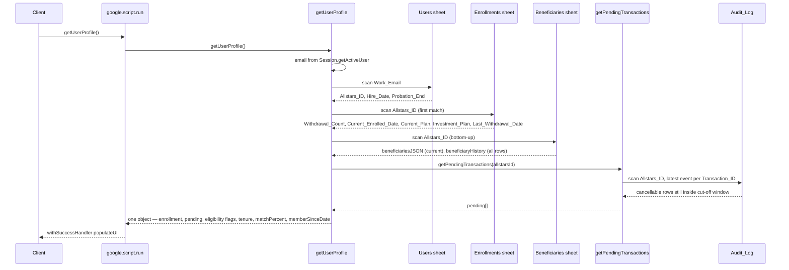

# Profile Read & Eligibility Path

The dashboard the employee sees is not a static page; it is a server-computed snapshot of their membership state. `getUserProfile()` (`Code/Profile.gs`) is the single read call the SPA fires on load and after every successful action's forced home-reload. It resolves the signed-in user server-side from the Apps Script session, joins the user's `Enrollments` row, reads the `Beneficiaries` ledger newest-first, calls `getPendingTransactions()` for the in-progress box, computes the eligibility flags (probation, cooldown, tenure, employer-match tier), and returns one object the frontend consumes wholesale in `populateUI()`. A second read call, `checkPlanChangeEligibility()` (`Code/Action.gs`), runs in parallel and pre-computes the 6-month plan-change lock so the change-plan modal opens in the right variant.

The rules that *frame* the eligibility flags (the payroll cut-off, the match tiers, the 6-month plan-change lock, the withdrawal-cooldown, the 5-year vesting, the probation block) are formalized on [Business Rules & Invariants](/openwiki/concepts/business-rules.md); the 9-state lifecycle those flags select between is on [Enrollment Lifecycle & User States](/openwiki/concepts/enrollment-lifecycle.md); the write-path actions whose eligibility this path gates (change plan, withdraw, cancel) are on [Plan Change, Withdrawal & Cancel](/openwiki/workflows/plan-change-withdraw-cancel.md); the SPA bootstrap that fires these calls is on [Frontend Single-Page App](/openwiki/architecture/frontend-spa.md).

## Identity is resolved server-side

`getUserProfile` never trusts the client for identity. The signed-in email comes from the Apps Script session:

```js
const userEmail = Session.getActiveUser().getEmail().toLowerCase().trim();
```

The client never sends, and cannot spoof, the email — `google.script.run` runs as the web-app's effective user, and `Session.getActiveUser()` is the identity the app is deployed to run as. The lookup matches that email case-insensitively (`.toLowerCase().trim()`) against the `Work_Email` column of the `Users` sheet. On a match it captures the row's `Allstars_ID` (the join key to every other sheet), `Name_English`, `Business_Title`, `Hire_Date`, and `Probation_End`. If no row matches, the function returns `{ success: false, msg: "ไม่พบข้อมูลผู้ใช้งาน (User not found): <email>" }`, which `populateUI` routes to `showError` — the dashboard never renders for an unknown user. Any exception is caught and returned as `{ success: false, msg: e.toString() }`, so a sheet/schema error degrades to the error state rather than throwing to `google.script.run`'s failure handler.

The sheet is opened by the global `SPREADSHEET_ID` (from `Config.gs`), and the sheet names come from the `SHEET_USERS` / `SHEET_ENROLLMENTS` / `SHEET_BENEFICIARIES` constants — so a sheet rename is a one-line config change, not a hunt through `Profile.gs`.

## The join: Users → Enrollments → Beneficiaries → Audit_Log

`getUserProfile` reads four sheets in sequence against the one `Allstars_ID`. The join is by `Allstars_ID`, not by email — email lives only on the `Users` sheet.



*The read path. `getPendingTransactions` is a separate function call, not a sheet the profile reads directly; it returns the cancellable in-progress rows derived from `Audit_Log`.*

### Enrollments join (first match wins)

With the `Allstars_ID` in hand, `getUserProfile` scans the `Enrollments` sheet for the first matching row and captures:

- `Withdrawal_Count` (the spine of the lifecycle — `0` through the 1st enrollment, `1` through the 2nd, `2` through the 3rd, `3` at permanent lockout; it ticks up only on a withdrawal),
- `Current_Enrolled_Date` (the current cycle's start — re-set on every (re-)enrollment),
- `Last_Withdrawal_Date` (the cooldown anchor for counts 1 and 2),
- `Current_Plan` (the **enrolled flag**: a set decimal = enrolled, blank = not enrolled),
- `Investment_Plan` (only if the `Investment_Plan` column exists — read defensively, so an older sheet without the column degrades to `null` rather than throwing).

`isEnrolled` is derived as `enrollmentData.currentPlan ? true : false` — a non-empty plan string is the single signal of enrollment. The loop `break`s on the first matching row, so the Enrollments sheet is assumed to have at most one row per `Allstars_ID`.

### Beneficiary ledger — read bottom-up

The `Beneficiaries` sheet is an append-only **ledger**, not a current-state table: every beneficiary update appends a new row rather than mutating the prior one. `getUserProfile` reads it bottom-up (`for k = benData.length - 1; k >= 1; k--`) so the **first match it hits is the newest, active row**. That row's `Beneficiary_Data` (the stored JSON of the beneficiary list) becomes `enrollmentData.beneficiariesJSON` — the *current* beneficiaries shown in the dashboard.

Every matching row is also pushed, newest-first, into `enrollmentData.beneficiaryHistory` (`[{ timestamp, data }, …]`), so the dashboard and the beneficiary manager can render the full edit history. The `Timestamp` column is read if present, otherwise it falls back to column 0. A beneficiary row is matched only when both the `Allstars_ID` and `Beneficiary_Data` columns are present in the sheet — the read is defensive, so a missing `Beneficiaries` sheet or missing columns degrade to an empty history rather than erroring.

### Pending transactions — `getPendingTransactions`

The in-progress box is a separate call, `getPendingTransactions(allstarsId)`, not a fourth sheet the profile reads directly. It scans the `Audit_Log` for rows matching the user's `Allstars_ID` with a non-blank `Transaction_ID`, keeps the **most recent row per `Transaction_ID`** (by `Timestamp`), and admits a row to the pending list only if **all three** hold:

1. the `Action` is in `CANCELLABLE_ACTIONS` — exactly `["Enroll", "Change Plan", "Withdraw"]`,
2. the latest `Event_Type` is `"SUBMITTED"` or `"EDITED"`,
3. `isWithinEditableWindow(submittedAt)` is true (the next upcoming 15th at 23:59:59 Bangkok time has not yet passed).

Beneficiary and investment-plan changes log a `SUBMITTED` row but are deliberately excluded — they take effect immediately (no payroll cycle, no cancel state), so they must never appear as cancellable in-progress rows. Each pending entry carries `{ transactionId, type, description, submittedAt, editableUntil, currentValues }`; `description` is built per action type (e.g. `"Enrollment to <pct>% plan"`, `"Plan change to <pct>%"`, `"Withdrawal from fund"`), and `editableUntil` is the same cut-off deadline `cancelTransaction` re-checks before reverting. The `currentValues` is the `Event_Data.newValues` snapshot, which the dashboard uses to render the plan % in the in-progress row. See [Plan Change, Withdrawal & Cancel](/openwiki/workflows/plan-change-withdraw-cancel.md) for the cancel path that consumes these.

## Eligibility computation

After the joins, `getUserProfile` computes the eligibility flags the UI cascade reads. All of them are **client-side display logic** in the sense that the write handlers (`processEnrollment`, `processWithdrawal`, `processUpdateBeneficiaries`) do **not** re-validate them server-side — only `processChangePlan` re-validates the 6-month plan-change lock. The flags are computed from sheet columns and `today`, never persisted as their own columns.

### Probation

Read from the `Users` sheet's `Probation_End`:

```js
if (rawProbationDate instanceof Date && rawProbationDate > today) {
  isOnProbation = true;
  probationEndDateStr = String(rawProbationDate);
}
```

`isOnProbation` is true only when `Probation_End` is a real date **and** still in the future; a blank or past date means the employee has cleared probation. The end date is surfaced as a string so the dashboard can show "Eligible to enroll after …" without re-parsing the sheet.

### Cooldown (6-month re-enrollment block)

The cooldown blocks re-enrollment for 6 months after the **1st or 2nd** withdrawal — it does **not** apply at the 3rd (the 3rd is a permanent lockout with no cooldown):

```js
if ((enrollmentData.withdrawalCount === 1 || enrollmentData.withdrawalCount === 2)
    && enrollmentData.lastWithdrawalDate instanceof Date) {
  let unlockDate = new Date(enrollmentData.lastWithdrawalDate);
  unlockDate.setMonth(unlockDate.getMonth() + 6);
  if (today < unlockDate) { isCoolingDown = true; cooldownEndDate = String(unlockDate); }
}
```

The cooldown-vs-ready distinction is decided **purely** by `Last_Withdrawal_Date + 6 months` relative to `today` — there is no separate flag; the date *is* the switch. `cooldownEndDate` is surfaced so the dashboard's "Re-enroll on …" message can render it without recomputing the 6 months. A `Withdrawal_Count` of `3` short-circuits this branch in `populateUI` (lockout is checked first) — and the cooldown branch itself only fires for counts 1 and 2, so a locked-out user never also reports a cooldown.

### Tenure — the membership-start rule

Which date tenure is measured from is itself a rule, and it changes on re-enrollment. `startDateForMath` defaults to `Hire_Date`, but switches to `Current_Enrolled_Date` when `Withdrawal_Count >= 1` **and** the enrolled date is a real date:

```js
let startDateForMath = rawHireDate;
if (enrollmentData.withdrawalCount >= 1 && enrollmentData.enrolledDate instanceof Date) {
  startDateForMath = enrollmentData.enrolledDate;
}
```

The rule: a first enrollment measures tenure from `Hire_Date`; a re-enrollment after any withdrawal **restarts the clock** at the new `Current_Enrolled_Date`. This is why the dashboard consumes `memberSinceDate` / `tenureY` / `tenureM` from `getUserProfile` rather than the raw `enrolledDate` column — the column does not recompute on re-enrollment, the function does.

From `startDateForMath`, `getUserProfile` derives three tenure values:

- `tenureYears` — fractional years, `((today - startDateForMath) / ms-per-year)`, used for the **match tier** (and serialized to two decimals).
- `tenureY` — whole years, via month-difference math (`(yrNow - yrStart) * 12 + (moNow - moStart)`, decremented if the day-of-month hasn't passed yet), used for the **5-year vesting** display.
- `tenureM` — whole months, the remainder of the same month-difference, used for the dashboard's "Xy Ym" duration display.

`memberSinceDate` is `startDateForMath` (or `null` if it is not a real date). All three tenure values and `memberSinceDate` are returned on the top-level object, not nested under `enrollment`.

### Match tier

`matchPercent = calculateMatchTier(tenureYears)` (`Code/Utils.gs`) maps the fractional tenure onto four bands:

| Tenure (years from `memberSinceDate`) | Employer match |
|---|---|
| `< 5` | `3%` |
| `5 – < 7` | `5%` |
| `7 – < 10` | `7%` |
| `≥ 10` | `10%` |

The function is a simple threshold ladder (`< 5` → `3%`, `< 7` → `5%`, `< 10` → `7%`, else `10%`), so the upper bound of each band is exclusive. Because it takes `tenureYears` (fractional), a member at 4.9 years is `3%` and at 5.0 years is `5%`.

## The returned object

`getUserProfile` returns a single flat-ish object (the eligibility flags are top-level; the sheet-join data is nested under `enrollment`). The frontend consumes **all** of these in `populateUI` — there is no second fetch for any of these fields.

| Field | Type | Source | Consumed by |
|---|---|---|---|
| `success` | boolean | always true on the happy path | `populateUI` guard |
| `name`, `title`, `hireDate`, `allstarsId` | string | `Users` row | name, id, hire-date tiles |
| `enrollment.isEnrolled` | boolean | `Current_Plan` non-empty | status cascade |
| `enrollment.withdrawalCount` | number | `Enrollments.Withdrawal_Count` | lockout + "Enrolled #N" |
| `enrollment.currentPlan`, `investmentPlan`, `beneficiariesJSON`, `beneficiaryHistory` | various | `Enrollments` + `Beneficiaries` | dashboard info, beneficiary manager |
| `enrollment.enrolledDate`, `lastWithdrawalDate` | string\|null | `Enrollments` dates | re-enroll tenure + cooldown timeline |
| `pendingTransactions` | array | `getPendingTransactions` | in-progress box |
| `isOnProbation`, `probationEndDate` | boolean, string\|null | `Users.Probation_End` | status cascade + "eligible after" |
| `isCoolingDown`, `cooldownEndDate` | boolean, string\|null | `Last_Withdrawal_Date + 6mo` | status cascade + "re-enroll on" |
| `matchPercent` | string | `calculateMatchTier` | "infoMatch" tile |
| `memberSinceDate` | string\|null | `Hire_Date` or `Current_Enrolled_Date` | "infoSince" tile |
| `tenureYears` | string (2dp) | `startDateForMath` diff | match tier input |
| `tenureY`, `tenureM` | number | month-diff from `startDateForMath` | vesting check, duration display |
| `todayBangkok` | `yyyy-MM-dd` | `Utilities.formatDate(... "Asia/Bangkok")` | withdrawal timeline active-step |

`todayBangkok` is worth calling out: the eligibility math uses `new Date()` (the script timezone) for the comparisons, but the withdrawal-timeline builder needs a Bangkok-anchored today so the active step doesn't flip across a timezone boundary — so the function formats today explicitly in `Asia/Bangkok` and passes it down. The dates that thread into the UI (`enrolledDate`, `lastWithdrawalDate`, `probationEndDate`, `cooldownEndDate`, `memberSinceDate`) are all serialized to strings here, not left as `Date` objects, so the frontend re-parses them with `new Date(...)` for display.

## `checkPlanChangeEligibility` — the parallel lock pre-compute

`checkPlanChangeEligibility()` (`Code/Action.gs`) runs alongside `getUserProfile` on `DOMContentLoaded` (and again after every successful action's home-reload). It re-resolves the user by email (the same `Users` scan, separate from `getUserProfile`'s — it does not share state), then reads `Last_Plan_Change_Date` and `Current_Enrolled_Date` from the `Enrollments` row, coerces each to a `Date` (falling back to `new Date(0)` when blank or not a date), takes `Math.max` of the two, adds 6 months, and returns:

```js
if (today.getTime() < nextEligibleDate.getTime()) {
  return { locked: true, nextDate: Utilities.formatDate(nextEligibleDate, Session.getScriptTimeZone(), "dd-MMM-yyyy") };
}
return { locked: false };
```

The frontend stores this in the module-global `planChangeStatus` (`applyCooldownUI`), and `openChangePlan` reads it to render the change-plan modal in its **locked** variant (disabled selector + "you can change again on …" message) vs its **selectable** variant. If the user is not found, the function returns `{ locked: false }` — a missing user degrades to "eligible" rather than blocking the modal.

This is a **pre-compute for the modal only**. The write-time refusal comes from `processChangePlan` re-deriving the same `max(lastChangeDate, enrollDate) + 6 months` math and rejecting if the window hasn't opened — so a stale `planChangeStatus` (e.g. the user keeps the page open past the unlock date) is harmless: the modal might show "locked" but the server would accept the change, and vice versa the server re-validates regardless. The two copies must agree on the rule but are independent; the write path is the one that actually protects the data. See [Plan Change, Withdrawal & Cancel](/openwiki/workflows/plan-change-withdraw-cancel.md) for the write-side lock and the self-reinforcing anchor (every successful change pushes the next-eligible date 6 months forward by stamping `Last_Plan_Change_Date = today`).

The lock applies **only to contribution %**. Investment-plan changes and beneficiary updates are not throttled by it (and are not payroll-cycled — they take effect immediately and have no cancellable pending state).

## `populateUI` — the consumer

`populateUI(response)` (`html/JS.html`) is the single success handler for `getUserProfile`. On `response.success` it stashes `response.enrollment` into the module-global `globalEnrollmentData` and the whole `response` into `globalUserProfile` (so the withdrawal modal's vesting check and the beneficiary manager can read `tenureY` and `beneficiariesJSON` without a second fetch), shows `#dashboardContent`, renders the in-progress box from `pendingTransactions`, then runs the **status cascade** — a strict, non-commutative order where the first matching state wins and short-circuits the rest:

1. **Permanent lockout** — `enrollment.withdrawalCount >= 3` → "หมดสิทธิ์ถาวร / Locked" (red), plus `showWithdrawalMessage` (the withdrawal timeline with no "re-enroll on" footer).
2. **Probation** — `isOnProbation` → "ระหว่างทดลองงาน / Probation" (amber), plus a "Eligible to enroll after `<probationEndDate>`" message.
3. **Cooldown** — `isCoolingDown` → "ระงับสิทธิ์ชั่วคราว / Cooldown" (purple), plus `showWithdrawalMessage` (the timeline **with** a "Re-enroll on `<cooldownEndDate>`" footer).
4. **Enrolled** — `enrollment.isEnrolled` → "เป็นสมาชิก ครั้งที่ N / Enrolled #N" (green), showing the `memberSinceDate` + `tenureY`/`tenureM` duration, the current plan %, and the `matchPercent` tile; reveals the enrolled-actions grid. If a pending `Enroll` exists, the status pill shows "—" instead (the enrollment is in-flight, not yet confirmed).
5. **Eligible** — default → "มีสิทธิ์สมัครได้ ครั้งที่ N / Eligible #N", shows the enroll button.

The "N" in "Enrolled #N" / "Eligible #N" is `withdrawalCount + 1` — the **attempt number** (1st, 2nd, 3rd enrollment), not the count. A user with `withdrawalCount = 0` is on their 1st enrollment; `withdrawalCount = 2` is on their 3rd (and last permitted) enrollment.

### The in-progress box

For each `pendingTransactions` entry, `populateUI` builds a row with a bilingual description (re-derived from `tx.currentValues.Current_Plan` for Enroll/Change Plan, or the static "Withdrawal from fund" for Withdraw), the `submittedAt` and `editableUntil` timestamps, and a Cancel button that calls `openCancelTx(transactionId, type)`. The box is hidden when the array is empty. The Cancel button is the only entry point to `cancelTransaction`; the same `editableUntil` deadline that admits the row here is the one `cancelTransaction` re-checks before reverting.

### The cooldown/withdrawal message

`showWithdrawalMessage(response)` renders the `#cooldownMessage` div for both the locked-out (count ≥ 3) and cooling-down (count 1 or 2) states. It builds a withdrawal timeline via `buildWithdrawalTimeline(wdDate, response.todayBangkok)` — a 4–5 step tracker (Submission → Cut-Off → Last Deduction → Processing → Expected Payout) whose active step is computed from `todayBangkok` so the "active" dot is correct regardless of the script timezone. The footer shows the "Re-enroll on `<cooldownEndDate>`" date **unless** `withdrawalCount >= 3` (the permanent lockout has no re-enrollment path, so the footer is suppressed).

### After-action feedback

`populateUI` also checks the module-global `pendingFeedbackAction`: if a prior action set it (e.g. `'Enroll'`, `'Change Plan'`, `'Withdraw'`, `'Cancel'`), `populateUI` clears it and opens the feedback modal on a 300 ms timeout — so the post-action rating prompt lands on the freshly-reloaded home screen rather than on the now-closed modal.

## The forced home-reload re-enters this path

Every mutating action ends with `showSuccessToast(message)`, which — after the toast fades — hides `#dashboardContent`, re-shows `#loadingState`, and re-issues **both** `getUserProfile` (→ `populateUI`) and `checkPlanChangeEligibility` (→ `applyCooldownUI`). This is the SPA's substitute for a server round-trip: the sheet has changed, so the client re-reads the canonical state rather than patching the DOM from the action's response. The toast is the only user-visible confirmation; the modal/wizard is already closed by the time the reload fires. Because this re-render does **not** re-fire `DOMContentLoaded`, `trackAppOpen` does not double-count on a reload (it only fires on a real page load — see [Frontend Single-Page App](/openwiki/architecture/frontend-spa.md)).
